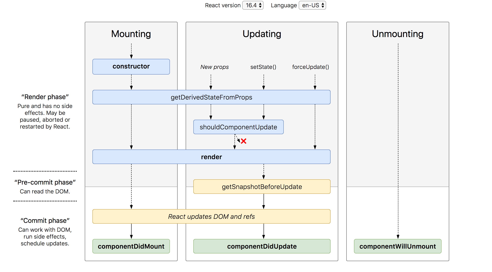
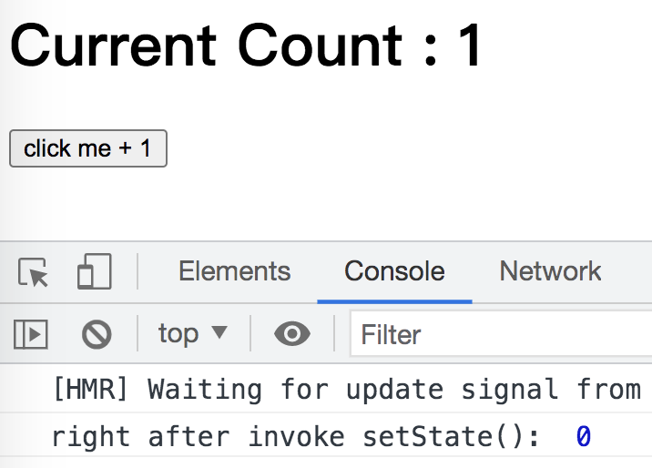

## React簡介 

react是什麼？ 

React用於構建用戶界面的JS庫。是一個將數據渲染為HTML視圖的開源JS庫。

為什麼學？ 

1.原生JS操作DOM繁瑣，效率低 

2.使用JS直接操作DOM,瀏覽器會進行大量的重繪重排 

3.原生JS沒有組件化編碼方案，代碼復用低

Feature of React:

1. 使用組件化模式、聲明式編程，提高開發效率及組件復用
2. React Native --> for mobile
3. Virtual DOM + Diffing Algorithm, 減少與真實DOM的交互

## basic

 ```js
<!DOCTYPE html>
<html lang="en">
<head>
  <meta charset="UTF-8">
  <meta name="viewport" content="width=device-width, initial-scale=1.0">
  <title>Document</title>
</head>
<body>
  <!-- prepare component -->
  <div id="test">

  </div>
</body>
<!-- 引入依賴 ,引入的時候，必須就按照這個步驟 -->
<!-- react core library ==> 全局多了物件 React-->
<script src="../React-js/react.development.js" type="text/javascript"></script>
<!-- support manipulate DOM tree ==> 全局多了物件 ReactDOM--->
<script src="../React-js/react-dom.development.js" type="text/javascript"></script>
<!-- jsx translate to js -->
<script src="../React-js/babel.min.js" type="text/javascript"></script>

<!--這裡使用了babel用來解析jsx語法-->
<script type="text/babel">
  // 1.創建虛擬DOM
  const VDOM = <h1>Hello React</h1> //不需要加"",because it is not String(js), it is jsx
  const VDOM2 = <h1>Hello React2</h1>
  // 2.渲染，如果有多個渲染同一個容器，後面的會將前面的覆蓋掉
  // ReactDOM.render(virtualDOM, component)
  ReactDOM.render(VDOM,document.getElementById("test"));
  ReactDOM.render(VDOM2,document.getElementById("test"));//替換操作
</script>

</html>
 ```

### virtual DOM creation

> jsx

```html
<!DOCTYPE html>
<html lang="en">
<head>
  <meta charset="UTF-8">
  <meta name="viewport" content="width=device-width, initial-scale=1.0">
  <title>Document</title>
</head>
<body>
  <!-- prepare component -->
  <div id="test">

  </div>
</body>
<!-- 引入依賴 ,引入的時候，必須就按照這個步驟 -->
<!-- react core library -->
<script src="../React-js/react.development.js" type="text/javascript"></script>
<!-- support manipulate DOM tree-->
<script src="../React-js/react-dom.development.js" type="text/javascript"></script>
<!-- jsx translate to js-->
<script src="../React-js/babel.min.js" type="text/javascript"></script>


<!--這裡使用了babel用來解析jsx語法-->
<script type="text/babel">
  // 1.創建虛擬DOM
  const VDOM = (
    <h1 id="title">
      <span>Hello React by jsx</span>
    </h1>
  )
  //不需要加"",because it is not String(js), it is jsx
  // 2.渲染，如果有多個渲染同一個容器，後面的會將前面的覆蓋掉
  // ReactDOM.render(virtualDOM, component)
  ReactDOM.render(VDOM,document.getElementById("test"));
</script>

</html>
```


> js

```html
<!DOCTYPE html>
<html lang="en">
<head>
  <meta charset="UTF-8">
  <meta name="viewport" content="width=device-width, initial-scale=1.0">
  <title>Document</title>
</head>
<body>
  <!-- prepare component -->
  <div id="test">

  </div>
</body>
<!-- 引入依賴 ,引入的時候，必須就按照這個步驟 -->
<!-- react core library -->
<script src="../React-js/react.development.js" type="text/javascript"></script>
<!-- support manipulate DOM tree-->
<script src="../React-js/react-dom.development.js" type="text/javascript"></script>
<!-- jsx translate to js , using js == no need babel-->


<!--這裡 no need babel 來解析jsx語法-->
<script type="text/javascript">
  // 1.創建虛擬DOM(using js rather than jsx)
  const VDOM = React.createElement('h1',{id: 'title'}, '<span>Hello React by js</span>'); //<span>Hello React by js</span>
  const VDOM2 = React.createElement('h1',{id: 'title'}, React.createElement('span', {}, 'Hello React by js'));
  // 2.渲染，如果有多個渲染同一個容器，後面的會將前面的覆蓋掉
  // ReactDOM.render(virtualDOM, component)
  ReactDOM.render(VDOM2,document.getElementById("test"));
</script>

</html>
```

使用JS和JSX都可以創建虛擬DOM，但是可以看出JS創建虛擬DOM比較繁瑣，尤其是標籤如果很多的情況下，所以還是比較推薦使用JSX來創建。

### What is virtual DOM

```js
<body>
  <!-- prepare component -->
  <div id="test">

  </div>
</body>

<!--這裡使用了babel用來解析jsx語法-->
<script type="text/babel">
  // 1.創建虛擬DOM
  const VDOM = (
    <h1 id="title">
      <span>Hello React by jsx</span>
    </h1>
  )
  // 2.渲染，如果有多個渲染同一個容器，後面的會將前面的覆蓋掉
  // ReactDOM.render(virtualDOM, component)
  ReactDOM.render(VDOM,document.getElementById("test"));
  const TDOM = document.getElementById("test");
  
  console.log('VDOM : ', VDOM);
  console.log(typeof(VDOM));
  console.log(VDOM instanceof Object);
  console.log('TDOM : ', TDOM);
  debugger
  // 1.虛擬DOM本質就是一個對象
  // 2.虛擬DOM比較的輕(since olny use in React)，真實的DOM比較的重，屬性比較多
  // 3.React woul transfer VDOM int TDOM
</script>
```

### JSX基礎語法 

1.定義虛擬DOM，不能使用“” 

2.標籤中混入JS表達式的時候使用{} 

3.樣式的類名指定不要使用class，使用className 

4.內斂樣式要使用雙大括號包裹` style={{key: value}}`

5.不能有多個根標籤，只能有一個跟標籤 

6.標籤必須閉合 

7.如果小寫字母開頭，就將標籤轉化為html同名元素，如果html中無該標籤對應的元素，就報錯；如果是大寫字母開頭，react就去渲染對應的組件，如果沒有就報錯

```js
<!DOCTYPE html>
<html lang="en">
<head>
  <meta charset="UTF-8">
  <meta name="viewport" content="width=device-width, initial-scale=1.0">
  <title>Document</title>

  <style>
    .title{
      background-color: orange;
      width: 200px;
    }
  </style>
</head>
<body>
  <!-- prepare component -->
  <div id="test">

  </div>
</body>
<!-- 引入依賴 ,引入的時候，必須就按照這個步驟 -->

<!--這裡使用了babel用來解析jsx語法-->
<script type="text/babel">
  const MyId = "kjGUOnvg";
  const MyData = "LalaDance";
  // 1.創建虛擬DOM
  //1.定義虛擬DOM，不能使用“”
  //2.標籤中混入JS表達式的時候使用{}
  //3.樣式的類名指定不要使用class，使用className
  const VDOM = (
    //5.不能有多個根標籤，只能有一個跟標籤
    //4.內斂樣式要使用雙大括號包裹 style={{key: value}}
    <div>
      <h1 className="title" id={MyId.toLowerCase()}>
        <span style={{color:'white', fontSize:'20px'}}>{MyData.toLowerCase()}</span>
      </h1>
      <h1 className="title" id={MyId.toLowerCase()+'2'}>
        <span style={{color:'white', fontSize:'20px'}}>{MyData.toLowerCase()}</span>
      </h1>
      <input type="text"/>
    </div>
  )
  // 2.渲染，如果有多個渲染同一個容器，後面的會將前面的覆蓋掉
  // ReactDOM.render(virtualDOM, component)
  ReactDOM.render(VDOM,document.getElementById("test"));

</script>

</html>
```

> 關於JS表達式和JS語句： 

- JS表達式：返回一個值，可以放在任何一個需要值的地方
  - a 
  - a+b 
  - demo(a) 
  - arr.map() 
  - function text(){} 
- JS語句：
  - if(){} 
  - for(){} 
  - while (){} 
  - swith(){} 
  - 不會返回一個值


## component

1) 理解: 向外提供特定功能的 js 程序, 一般就是一個 js 文件
2) 為什麼: js 代碼更多更複雜
3) 作用:復用js,簡化js的編寫,提高js運行效率

組件

1) 理解: 用來實現特定(局部)界面功能效果的代碼集合(html/css/js/image)
2) 為什麼: 一個界面的功能更複雜
3) 作用: 復用編碼, 簡化項目編碼, 提高運行效率

當應用是以多組件的方式實現, 這個應用就是一個組件化的應用

````js
<!DOCTYPE html>
<html lang="en">
<head>
  <meta charset="UTF-8">
  <meta name="viewport" content="width=device-width, initial-scale=1.0">
  <title>Document</title>
</head>
<body>
  <!-- 準備好容器 -->
  <div id="test"></div>
  
  <div id = "div"></div>

</body>
<!-- 引入依賴 -->


<!--這裡使用了babel用來解析jsx語法-->
<script type="text/babel">
      // 1.創建函數式組件
      function Demo(){
          console.log(this); //這個this是undefined,因為babel編譯之後開啟了嚴格模式
          return <h2>function component</h2>
      }
      //函數式組件還可以添加參數
      function Show(props){
          return <h1>Hello {props.age}</h1>
      }
      //2.渲染組件

      ReactDOM.render(<Demo />,document.getElementById("test"));
      ReactDOM.render(<Show age="88" />,document.getElementById("div"));
      //注意事項：
      /*
      1.組件的首字母必須是大寫，並且有返回值
      2.在渲染的時候必須<組件名 />
      */

      //執行過程：
      //1.React解析組件標籤，找到相應的組件。
      //2.發現組件是函數定義的，隨後調用函數，將返回的虛擬DOM轉化為真實DOM,隨後呈現在頁面中。

      //在類中，一般方法是放在原型對像上的，供實例使用
      //方法中的this主要取·決於是誰調用了他
</script>
````

### 自定義組件(Component) :

> 方式 1: 工廠函數組件(簡單組件) function component

```js
// 1.創建函數式組件
function Demo(){
  console.log(this); //這個this是undefined,因為babel編譯之後開啟了嚴格模式
  return <h2>function component</h2>
}
//函數式組件還可以添加參數
function Show(props){
  return <h1>Hello {props.age}</h1>
}
//2.渲染組件

ReactDOM.render(<Demo />,document.getElementById("test"));
ReactDOM.render(<Show age="88" />,document.getElementById("div"));
//注意事項：
/*
      1.組件的首字母必須是大寫，並且有返回值
      2.在渲染的時候必須<組件名 />
      */

//執行過程：
//1.React解析組件標籤，找到相應的組件。
//2.發現組件是函數定義的，隨後調用函數，將返回的虛擬DOM轉化為真實DOM,隨後呈現在頁面中。

//在類中，一般方法是放在原型對像上的，供實例使用
//方法中的this主要取·決於是誰調用了他
```


> 方式 2: ES6 類組件(複雜組件) class component

```js
// 1.創建類式組件 [必須繼承React.Component]
class MyComponent extends React.Component{
  render(){
    //render是放在原型對像上的，供實例對象使用
    //render的this，MyComponent的實例對象【組件實例對象】
    return <h1>這個是類組件</h1>
  }
}

//2.渲染組件
ReactDOM.render(<MyComponent />,document.getElementById("test"))

//執行過程：
//1.React解析組件標籤，找到相應的組件
//2.發現組件是類定義的，隨後new出來的類的實例，並通過該實例調用到原型上的render方法
//3.將render返回的虛擬DOM轉化為真實的DOM,隨後呈現在頁面中


//複雜組件：有狀態的
//簡單組件：沒有狀態的
//組件的狀態裡面保存著數據 state
```


### render()

注意

1. 組件名必須首􏰂母大寫
2. 虛擬DOM 元素只能有一個根元素
3. 虛擬DOM 元素必須有結束標籤

render()渲染組件標籤的基本流程

1. React內部會創建組件實例對象
2. 調用render()得到虛擬DOM, 並解析為真實DOM 
3. 插入到指定的頁面元素內部

## 組件實例三大屬性 

only consider class_component (have instance), since function don't have own  'this', 何來實例和實例上的屬性

Function_component --> hooks (after 17.x.x)

class component --> state, props, refs

Function component --> props (since function has parameter)

### state

1. state 是組件對象最重要的屬性, `值是對象(可以包含多個數據) `
2. 組件被稱為"狀態機", 通過更新組件的 state 來更新對應的頁面顯示(重新渲染組件)

>notice

1. 組件中 render() 方法中的 this 為實體物件

2. 組件中自定義方法中的 this 為 undefined (作為callback function調用＝全局調用)，如何解決？

   - 強制綁定 this：bind()

   - arrow function, 要用賦值語句的形式 ＋ 箭頭函數

3. 狀態數據，不能直接更改，須通過 React.Component 中的 setState()

#### initailize state

```js
constructor (props) { 
  super(props) 
  this.state = {
    stateProp1 : value1,
    stateProp2 : value2 
  }
}

讀取某個狀態值
this.state.statePropertyName
```

#### 實體物件調用原型鏈上方法

```js
// 1.創建component
class Weather extends React.Component{
  constructor(props){ // this --> Weather 的實例物件
    super(props)
    this.state = {isHot :false}
  }
  render(){ // this --> Weather 的實例物件
    console.log(this); // Weather 的實例物件, 此時的例物件沒有自身的changeWether()
    const {isHot} = this.state
    return <h1 onClick={this.changeWether}> Today is {isHot ? 'hot' : 'cool'} </h1>
  }
  changeWether(){ // this --> undefined, 因為此方訪視作為 onClick 回調函數'直接'被調用，非通過實體物件調用，又因為 React 默認開啟局部嚴格模式 ===> this==undefined,
    console.log(this); // undefined，類中所定義的方法默認開啟局部嚴格模式
  }
}

// 2.渲染，如果有多個渲染同一個容器，後面的會將前面的覆蓋掉
ReactDOM.render(<Weather/>,document.getElementById("test"));
```


```js
// 1.創建component
class Weather extends React.Component{
  constructor(props){
    super(props)
    this.state = {isHot :false}
    // console.log(this); // Weather 的實例物件
    this.changeWetherForInstance = this.changeWether.bind(this)
    // 等式右邊：創造一個新的函數（changeWether() 從 Weather 的原型對象上取得），該函數的值為實例物件，
    // 等式左邊：並將函數放到實例物件上，並將該方法取名為 changeWetherForInstance()
  }
  render(){
  	console.log(this); // Weather 的實例物件
    const {isHot} = this.state
    return <h1 onClick={this.changeWetherForInstance}> Today is {isHot ? 'hot' : 'cool'} </h1>
  }
  changeWether(){...}
}
```


#### 更新狀態---->組件界面更新

```js
this.setState({ 
  stateProp1 : value1, 
  stateProp2 : value2
})
```


```js
class Weather extends React.Component{
  constructor(props){
    super(props)
    this.state = {isHot:false, wind:'flow'}
    this.changeWetherForInstance = this.changeWether.bind(this)
  }
  render(){
    console.log(this); // Weather 的實例物件
    const {isHot, wind} = this.state
    return <h1 onClick={this.changeWetherForInstance}> Today is {isHot ? 'hot' : 'cool'}, {wind} </h1>
  }
  changeWether(){ // this method is on Weather not instance ==> 原型戀上的方法
    // obtain original data of isHot
    const isHot = this.state.isHot
    console.log(this);
    this.setState({isHot: !isHot}) // state must be alter by setState(), 且更新是一種合併，不是替換

    // this.state.isHot = !isHot // *** state con not be alter directory *** , since React 不認可這種方式
    // console.log(this.state.isHot);
  }
}
```


#### shortcut of creating function on instance

```js
class Car{
  constructor(name, price) {
    this.name = name;
    this.price = price
    //this.wheel = 4
  }
  // 類中可以直接寫賦值語句，如下代碼含義：給 Car的`實體物件` 添加一個屬性，名為a，值為1
  a = 1
	wheel = 4
}
const c1 = new Car('Tesla', 99999)
const c2 = new Car('Bens', 66666)
console.log(c1);
console.log(c2);
```


```js
// 1.創建component
class Weather extends React.Component{
  constructor(props){
    super(props)
    //this.state = {isHot:false, wind:'flow'}
    //this.changeWetherForInstance = this.changeWether.bind(this)
  }
  state = {isHot:false, wind:'flow'}

  render(){
    const {isHot, wind} = this.state
    return <h1 onClick={this.changeWetherForInstance}> Today is {isHot ? 'hot' : 'cool'}, {wind} </h1>
  }
	// changeWether 從原型戀上的方法 變為 變成實體物件上的方法屬性
  changeWether = function(){ 
    const isHot = this.state.isHot
    this.setState({isHot: !isHot})
    console.log(this); // this == undefined --> error
  }
}
```


```js
// 1.創建component
class Weather extends React.Component{
	// initialzed state
  state = {isHot:false, wind:'flow'}

  render(){...}
  
  // self-defined method，要用賦值語句的形式 ＋ 箭頭函數
  // changeWether 從原型戀上的方法 變為 變成實體物件上的方法屬性
  changeWether = () => {
    const isHot = this.state.isHot
    this.setState({isHot: !isHot})
    console.log(this); // this == weather instance
  }
}
```


### props

理解

1. 每個組件對像都會有props(properties 的簡寫)屬性
2. 組件標籤的所有屬性都保􏰃在props 中

作用

1. 通過標籤屬性從組件外向組件內傳遞變化的數據
2. 注意: 組件內部不要修改props 數據向組件標籤傳遞

區別一下組件的 props 和 state 屬性 

1. state: 組件自身內部可變化的數據 

2. props: 從組件外部向組件內部傳遞數據, 組件內部只讀不修改

#### 內部讀取某個屬性值

```js
內部讀取某個屬性值 this.props.propertyName
擴展屬性：將物件的所有屬性通過props傳遞 <Person {...p}/> 
// 這裡的 {} 代表js表達式， ...p 僅適用於標籤屬性的傳遞
```


```js
  // 1.創建 component
  class Person extends React.Component{
    render(){
      console.log(this);
      const {name, age, gender} = this.props
      return (
        <ul>
          <li>Name : {this.props.name}</li>
          <li>Gender : {this.props.gender}</li>
          <li>Age : {this.props.age+1}</li>
          // const {name, age, gender} = this.props
          <li>Name : {name}</li>
          <li>Gender : {gender}</li>
          <li>Age : {age+1}</li>
        </ul>
      )
    }
  }

  const p = {name:'Rose', age:34, gender:'female'}
  console.log('@', ...p); // not working
  // 2.渲染，如果有多個渲染同一個容器，後面的會將前面的覆蓋掉
  ReactDOM.render(<Person name="Lisa" age ="22" gender="female"/>,document.getElementById("test")); // age ="22" --> String
  ReactDOM.render(<Person name="Tom" age ={24} gender="male"/>,document.getElementById("test2")); // age ={24}  --> Number(js裡面才有類型判斷)
  //ReactDOM.render(<Person name={p.name} age={p.age} gender={p.gender}/>,document.getElementById("test3"));
  ReactDOM.render(<Person {...p}/>,document.getElementById("test3")); // 批量傳遞
  // 這裡的 {} 代表js表達式， ...p 僅適用於標籤屬性的傳遞
```

#### 對組件的屬性對其進行限制


Problem:

1. 對傳遞的標籤屬性 props 類型進行限制 `age ={24}`

2. 傳遞的標籤屬性 props 必要數據必須填寫 `name="Tom"`

3. 對傳遞的標籤屬性 props 某一屬性指定默認值 `  gender="female"`

```js
<!-- import prop-types, 用於對組件標籤屬性進行限制 , ==> 全局多了物件 PropTypes--->
<script src="../React-js/prop-types.js" type="text/javascript"></script>

//對組件的屬性對其進行限制
// propTypes-->React的要求
// PropTypes-->import prop-types
Person.propTypes = { 
  name:PropTypes.string.isRequired, // after 16.x.x, before==> React.PropTypes
  gender:PropTypes.string,
  age:PropTypes.number,
  speak:PropTypes.func
}
//指定默認的標籤屬性
Person.defaultProps = {
  gender:"none",
  age:18
}

function speak(){
  console.log('speaking');
}
```

#### Props read-only

```js
  class Person extends React.Component{
    render(){
      console.log(this);
      const {name, age, gender} = this.props
      //this.props.name = 'jack'// error --> props is readonly
      return (
        <ul>
          <li>Name : {name}</li>
          <li>Gender : {gender}</li>
          <li>Age : {age+1}</li>
        </ul>
      )
    }
  }
```

#### props shortcut

```js
// class property shortcut --------------------------------
class Car{
  constructor(name, price) {
    this.name = name;
    this.price = price
    //this.wheel = 4
  }
  // 類中可以直接寫賦值語句，如下代碼含義：給 Car的「實體物件」 添加一個屬性，名為a，值為1
  a = 1
  wheel = 4
  demo = 190 // 給「實體物件」加一個屬性
  static demo2 = 190 // add static ==> 給類（非實體物件）自身加一個屬性
}
Car.demo = 190 // 給類（非實體物件）自身加一個屬性
const c1 = new Car('Tesla', 99999)
const c2 = new Car('Bens', 66666)
console.log(c1);
console.log(c2);
```


```js
  class Person extends React.Component{
    //對組件的屬性對其進行限制
    static propTypes = {
        name:PropTypes.string.isRequired, //after 16.x.x
        gender:PropTypes.string,
        age:PropTypes.number,
        speak:PropTypes.func
    }
    
    //指定默認的標籤屬性
    static defaultProps = {
      gender:"none",
      age:18
    }

    render(){
      console.log(this);
      const {name, age, gender} = this.props
      //this.props.name = 'jack'// error --> props is readonly
      return (
        <ul>
          <li>Name : {name}</li>
          <li>Gender : {gender}</li>
          <li>Age : {age+1}</li>
        </ul>
      )
    }
  }
```

#### constructor

Typically, in React constructors are only used for two purposes:

- Initializing [local state](https://reactjs.org/docs/state-and-lifecycle.html) by assigning an object to `this.state`.
- Binding [event handler](https://reactjs.org/docs/handling-events.html) methods to an instance.

````js
class Weather extends React.Component{
  // 構造器被調用幾次？ ---- one time
  constructor(props){ // this --> Weather 的實例物件
    super(props)
    this.state = {isHot:false, wind:'flow'}
    this.changeWetherForInstance = this.changeWether.bind(this)
    // 等式右邊：創造一個新的函數（changeWether() 在 Weather 的原型對象上，供實例使用），該函數的值為實例物件，
    // 等式左邊：並將函數放到實例物件上，並將該方法取名為 changeWetherForInstance()
  }
...
}
````

Without constructor

**If you don’t initialize state and you don’t bind methods, you don’t need to implement a constructor for your React component.**

```js
	class Weather extends React.Component{
    // initialzed state
    state = {isHot:false, wind:'flow'}

    render(){
      const {isHot, wind} = this.state
      return <h1 onClick={this.changeWether}> Today is {isHot ? 'hot' : 'cool'}, {wind} </h1>
    }
    // self-defined method，要用賦值語句的形式 ＋ 箭頭函數
    // changeWether 從原型戀上的方法 變為 變成實體物件上的方法屬性
    changeWether = () => {
      const isHot = this.state.isHot
      this.setState({isHot: !isHot})
      console.log(this);
    }
  }

```

The constructor for a React component is called before it is mounted. When implementing the constructor for a `React.Component` subclass, you should call `super(props)` before any other statement. Otherwise, `this.props` will be undefined in the constructor, which can lead to bugs.

````js
class Person extends React.Component{
    constructor(props){
      //console.log(props);
      super(props);
      console.log('constructor: ', this.props); // this.props ===> 實體物件自身的 props
    }
  ...
}
  
--------------------------------------------------------
constructor:  {name: "Lisa", gender: "none", age: 18}
              age: 18
              gender: "none"
              name: "Lisa"
              __proto__: Object
````


```js
class Person extends React.Component{
    constructor(){
      //console.log(props);
      super();
      console.log('constructor: ', this.props); // this.props ===> 實體物件自身的 props
    }
  ...
}
--------------------------------------------------------
constructor:  undefined
```

if you want to use `this.props` in constructor, you should pass `props` to super() in constructor. => rarely use

Usually use `props` rather than` this.props`

```js
class Person extends React.Component{
    constructor(props){
      super(props);
      console.log('constructor: ', props); 
    }
  ...
}
```

#### props for function component

```js
  // 1.創建 component
  function Person(props){
    console.log(props);
    const{name, age, gender} = props
    return(
      	<ul>
          <li>Name : {name}</li>
          <li>Gender : {gender}</li>
          <li>Age : {age+1}</li>
        </ul>
    )
  }

  //對組件的屬性對其進行限制
  Person.propTypes = {
      name:PropTypes.string.isRequired, //after 16.x.x
      gender:PropTypes.string,
      age:PropTypes.number
  }

  //指定默認的標籤屬性
  Person.defaultProps = {
    gender:"none",
    age:18
  }
  
  // 2.渲染，如果有多個渲染同一個容器，後面的會將前面的覆蓋掉
  ReactDOM.render(<Person name="Lisa"  />,document.getElementById("test"));
```

### refs

1. 組件內的標籤都可以定義 ref 屬性來標識自己

   a.` <input type="text" ref={input => this.msgInput = input}/>`

   b. 回調函數在組件初始化渲染完或卸載時自動調用

2. 在組件中可以通過 this.msgInput 來得到對應的真實 DOM 元素
3. 作用: 通過 ref 獲取組件內容特定標籤對象, 進行讀取其相關數據

#### String ref

not recommend after 16.x.x

[Refs and the DOM](https://reactjs.org/docs/refs-and-the-dom.html)

> Legacy API: String Refs
>
> If you worked with React before, you might be familiar with an older API where the `ref` attribute is a string, like `"textInput"`, and the DOM node is accessed as `this.refs.textInput`. We advise against it because string refs have [some issues](https://github.com/facebook/react/pull/8333#issuecomment-271648615), are considered legacy, and **are likely to be removed in one of the future releases**.
>
> > Note
> >
> > If you’re currently using `this.refs.textInput` to access refs, we recommend using either the [callback pattern](https://reactjs.org/docs/refs-and-the-dom.html#callback-refs) or the [`createRef` API](https://reactjs.org/docs/refs-and-the-dom.html#creating-refs) instead.

結論：寫多效率變差

Using traditional js

```js
	// create component
  class Demo extends React.Component{
    showData = () => {
      console.log('show');
      const input1 = document.getElementById('input1')
      alert(input1.value)
    }
    render(){
      return(
        <div>
          <input id="input1" type="text" placeholder="click to show data"/>&nbsp
          <button onClick={this.showData}> click to show data in left handside</button>&nbsp
          <input type="text" placeholder="unblur to show data"/>&nbsp
        </div>
      )
    }
  }
  //
  ReactDOM.render(<Demo/>, document.getElementById('test'))
```

Refs 獲取虛擬DOM轉成真實DOM的節點

```js
  class Demo extends React.Component{
    showData = () => {
      console.log(this);
      console.log(this.refs.input1);
      //debugger // -->check real DOM
    }
    render(){
      return(
        <div>
          <input ref="input1" type="text" placeholder="click to show data"/>&nbsp
          <button onClick={this.showData}> click to show data in left handside</button>&nbsp
          <input type="text" placeholder="unblur to show data"/>&nbsp
        </div>
      )
    }
  }

  ReactDOM.render(<Demo a="2" c="3"/>, document.getElementById('test'))
```


#### refs --> callback function type

```js
	class Demo extends React.Component{
    render(){
      return(
        <div>
        // callback function : (a)=>{console.log(a);}
          <input ref={(a)=>{console.log(a);}} type="text" placeholder="click to show data"/> // a==ref當前所在的節點，把當前節點做為實參
      )
    }
  }

  ReactDOM.render(<Demo a="2" c="3"/>, document.getElementById('test'))
```


```js
class Demo extends React.Component{
    render(){
      return(
        <div>
          <input ref={(currentNode)=>{this.input1 = currentNode}} type="text" placeholder="click to show data"/> // 把 ref 當前所處的結點掛載到組件實體身上，取名為 input1，箭頭函數沒有自己的 this，往外找 render() 中的 this ==> this == 當前組件實體， 當前組件實體有一屬性 {input1: <input type="text" placeholder="click to show data"/>}
        
      )
    }
  }

  ReactDOM.render(<Demo a="2" c="3"/>, document.getElementById('test'))
```


````js
  class Demo extends React.Component{
    // show data in left thandside
    showData = () => {
      const {input1} = this;
      alert(input1.value)
    }
    // show data in right thandside
    showData2 = () => {
      const {input2} = this;
      alert(input2.value)
    }
    render(){
      return(
        //把當前結點放在當前組件實體身上，取名為 input1，箭頭函數沒有自己的 this，往外找 render() 中的 this ==> this == 當前組件實體
        <div>
          <input ref={(c)=>{this.input1 = c}} type="text" placeholder="click to show data"/>
          <button onClick={this.showData}> click to show data in left handside</button>
          <input onBlur={this.showData2} ref={(c)=>{this.input2 = c}} type="text" placeholder="onblur to show data"/>
        </div>
      )
    }
  }
  //
  ReactDOM.render(<Demo a="2" c="3"/>, document.getElementById('test'))
````

#### callback refs invoke time

> Caveats with callback refs
>
> If the `ref` callback is defined as an inline function, it will get called twice during updates (== invoke` render()`again == 更新頁面顯示 ), first with `null` and then again with the DOM element. This is because a new instance of the function is created with each render, so React needs to clear the old ref and set up the new one. You can avoid this by defining the `ref` callback as a bound method on the class, but note that it shouldn’t matter in most cases.

將方法體放在html標籤上上 == inline function

```js
  class Demo extends React.Component{

    state = {isHot:true}

    showInfo = () => {
      const {input1} = this
      alert(input1.value)
    }

    changeWeather = () => {
      const {isHot} = this.state
      this.setState({isHot:!isHot})
    }
    render(){ //更新頁面顯示
      const{isHot} = this.state
      return(
        <div>
          <h2>today is {isHot ? 'hot' : 'cool'}</h2>
          <input ref={(c)=>{this.input1 = c; console.log('@', c)}} type="text"/><br/>
          <button onClick={this.showInfo}>click me to show input data</button><br/>
          <button onClick={this.changeWeather}>click me to change weather</button>
        </div>
      )
    }
  }

  ReactDOM.render(<Demo/>, document.getElementById('test'))
```


solution

````js
  class Demo extends React.Component{
		//...
    saveInput = (c) => {
      this.input1 = c
      console.log('@', c)
    }

    render(){ //更新頁面顯示
      const{isHot} = this.state
      return(
        <div>
          <h2>today is {isHot ? 'hot' : 'cool'}</h2>
          {/*<input ref={(c)=>{this.input1 = c; console.log('@', c)}} type="text"/><br/>*/}{/* 將方法體放在html標籤上上 == inline function */}
          <input ref={this.saveInput} type="text"/><br/>{/* 將方法體放在實體物件上 */}
          <button onClick={this.showInfo}>click me to show input data</button><br/>
          <button onClick={this.changeWeather}>click me to change weather</button>
        </div>
      )
    }
  }
````

#### ref API : createRef

```js
  class Demo extends React.Component{
    /**
      React.createRef 調用後可以返回一個容器，該容器可以儲存被 ref 所標示得節點
    **/
    myRef = React.createRef()

		showData = () => {
      console.log(this.myRef);
    }
    render(){
      return(
        <div>
          {/* 將ref當前所在的節點存儲在實體物件中的myRef*/}
          <input ref={this.myRef} type="text" placeholder="click to show data"/><br/>
          <button onClick={this.showData}> click to show data in left handside</button><br/>
        </div>
      )
    }
  }
```


```js
  class Demo extends React.Component{
    /**
      React.createRef 調用後可以返回一個容器，該容器可以儲存被 ref 所標示得節點，該容器是“專人專用”的，後面放箭去的會覆蓋前面的
    **/
    myRef = React.createRef()
    // show data in left thandside
    showData = () => {
      console.log(this.myRef);
    }

    render(){
      return(
        <div>
          {/* 將ref當前所在的節點存儲在實體物件中的myRef*/}
          <input ref={this.myRef} type="text" placeholder="click to show data"/><br/>
          <button ref={this.myRef} onClick={this.showData}> click to show data in left handside</button><br/>
        </div>
      )
    }
  }
  
----------------console---------------------
{current: button} // 覆蓋前面的 {current: input}
```


```js
  class Demo extends React.Component{
    /**
      React.createRef 調用後可以返回一個容器，該容器可以儲存被 ref 所標示得節點，該容器是“專人專用”的，後面放箭去的會覆蓋前面的
    **/
    myRef = React.createRef()
    myRef2 = React.createRef()
    // show data in left thandside
    showData = () => {
      console.log(this.myRef);
      console.log(this.myRef.current.value);
    }
    showData2 = () => {
      console.log(this.myRef2);
      console.log(this.myRef2.current.value);
    }

    render(){
      return(
        <div>
          {/* 將ref當前所在的節點存儲在實體物件中的myRef*/}
          <input ref={this.myRef} type="text" placeholder="click to show data"/><br/>
          <button onClick={this.showData}> click to show data in left handside</button><br/>
          <input ref={this.myRef2} onBlur={this.showData2} type="text" placeholder="click to show data"/><br/>
        </div>
      )
    }
  }
  //
  ReactDOM.render(<Demo/>, document.getElementById('test'))
```

### react事件處理

事件處理

1. 通過 onXxx 屬性指定組件的事件處理函數(注意大小寫)

   a. React 使用的是自定義(合成)事件, 而不是使用的原生 DOM 事件 -- 為了更好的兼容性

   b. React 中的事件是通過事件委託方式處理的(委託給組件最外層的元素) -- 為了高效

2. 通過 event.target 得到發生事件的 DOM 元素對象

````js
<input onFocus={this.handleClick}/> 

handleFocus(event) {
	event.target //返回 input 對象 
}
````

 強烈注意

1. 組件內置的方法中的 this 為組件對象

2. 在組件類中自定義的方法中 this 為 null

   a. 強制綁定 this: 通過函數對象的 bind()

   b. 箭頭函數(ES6 模塊化編碼時才能使用)

#### 不要過度使用ref

[重新認識 JavaScript: Day 15 隱藏在 "事件" 之中的秘密](https://ithelp.ithome.com.tw/articles/10192015)

> 隱藏在 Handler 中的 "event"
>
> 當監聽的事件發生時，瀏覽器會去執行我們透過 `addEventListener()` 註冊的 Event Handler ([EventListener](https://developer.mozilla.org/zh-TW/docs/Web/API/EventListener)) ，也就是我們所指定的 `function`。
>
> 這個時候，EventListener 會去建立一個「事件物件」 (Event Object)，裡面包含了所有與這個事件有關的屬性，並且以「參數」的形式傳給我們的 Event Handler：

```js
<button id="btn">Click</button>


var btn = document.getElementById('btn');

// 參數 e 就是上面說的事件物件 (Event Object)
// 因為是參數，當然也可以自己定義名稱
btn.addEventListener('click', function(e){
  console.log(e);
}, false);
```

觸發DOM上的某個事件時， 會去產生一個「事件物件」 (Event Object)，兼容DOM的瀏覽器會將一個event物件傳入到事件處理程程式

**注意：**只有在事件處理程式執行期間，event物件才會存在；一旦事件處理程式執行完畢，event物件就會被銷燬。


發生事件的元素和要操作的DOM的元素是同一個 ==>   從 event 取值

```js
  class Demo extends React.Component{
    myRef2 = React.createRef()
    showData2 = () => {
      console.log(this.myRef2);
      console.log(this.myRef2.current.value);
    }
    render(){
      return(
        <div>
          {
          <input ref={this.myRef2} onBlur={this.showData2} type="text" placeholder="click to show data"/><br/>{/*發生事件和要操作的DOM原素是同一個*/}
        </div>
      )
    }
  }
```


```js
  class Demo extends React.Component{
    myRef2 = React.createRef()
    showData2 = (event) => {
      console.log(event.target.value);
    }

    render(){
      return(
        <div>
          <input onBlur={this.showData2} type="text" placeholder="click to show data"/><br/>{/*發生事件和要操作的DOM原素是同一個*/}
        </div>
      )
    }
  }
```

### 收集表單數據

#### uncontrolled component

所有有輸入類的DOM，包括輸入、選取表單，在執行回調函數時即立即從表單中讀取數據，及非受控表單

缺點：幾個輸入項就需要寫幾個 ref ==> 過度使用 ref

```js
  class Login extends React.Component{
    handleSubmit = (event) => {
      event.preventDefault() // prevent form submit == 避免頁面刷新/跳轉
      const {username, password} = this
      alert(`UserName: ${username.value}, Password: ${password.value}`);
    }
    render(){
      return (
        <form action="https://www.google.com" onSubmit={this.handleSubmit}>{/*要設法避免頁面刷新/跳轉*/}
          User : <input ref={(c)=>{this.username=c}} type="text" name="username"/>
          Password : <input ref={(c)=>{this.password=c}} type="password" name="password"/>
          <button>Login</button>
        </form>
      )
    }
  }

  ReactDOM.render(<Login/>, document.getElementById('test'))
```

#### Controlled component

輸入類的DOM隨著輸入的值的變化，將值維護到state中，等需要用時在從state中取出
==> 雙向綁定, avoid refs

````js
  class Login extends React.Component{
    // initialize state
    state = {
      username: '',
      password: ''
    }
    showUsername = (event) => {
      console.log(event.target.value);
      this.setState({username:event.target.value})
    }
    showPassword = (event) => {
      console.log(event.target.value);
      this.setState({password:event.target.value})
    }

    handleSubmit = (event) => {
      event.preventDefault() // prevent form submit == 避免頁面刷新/跳轉
      const {username, password} = this.state
      alert(`UserName: ${username}, Password: ${password}`);
    }
    
    render(){
      return (
        <form action="https://www.google.com" onSubmit={this.handleSubmit}>{/*要設法避免頁面刷新/跳轉*/}
          User : <input onChange={this.showUsername} type="text" name="username"/>
          Password : <input onChange={this.showPassword} type="password" name="password"/>
          <button>Login</button>
        </form>
      )
    }
  }

  ReactDOM.render(<Login/>, document.getElementById('test'))
````

with function curry

高階函數(higher order function)，

- 簡單說就是函數可以當作變數來用。因此就可以當作參數傳遞給函數，函數也以返回函數。 
                                          EX: new Promise(()=>{})
                                              setTimeout(()=>{}, 1000)
                                              arr.mao().filter()...

function currying   

- 通過函數調用繼續返回函數的方式，實現多次接收參數，最後統一處理的函數編寫形式
- 把接收多個參數的函數轉換成只接收一個參數的函數，當中就是利用函數返回函數的方式來達成。
- Currying 延遲求值的特性需要用到 JavaScript 中的作用域——說得更通俗一些，我們需要使用作用域來保存上一次傳進來的參數。

```js
  class Login extends React.Component{
    // initialize state
    state = {
      username: '',
      password: ''
    }
    // return a function as callback function --> curry function
    saveFormdata = (dataType) => {
      console.log(this, dataType)
      return (event) => {
        console.log(dataType, event.target.value);
        this.setState({[dataType]:event.target.value})
      }
    }

    handleSubmit = (event) => {
      event.preventDefault() // prevent form submit == 避免頁面刷新/跳轉
      const {username, password} = this.state
      alert(`UserName: ${username}, Password: ${password}`);
    }
    
    render(){
      return (
        <form action="https://www.google.com" onSubmit={this.handleSubmit}>
          User : <input onChange={this.saveFormdata('username')} type="text" name="username"/>{/* 返回函數調用後的返回值 as callback function */}
          Password : <input onChange={this.saveFormdata('password')} type="password" name="password"/>
          <button>Login</button>
        </form>
      )
    }
  }

  ReactDOM.render(<Login/>, document.getElementById('test'))
```

Without function curry

```js
  class Login extends React.Component{
    // initialize state
    state = {
      username: '',
      password: ''
    }

    saveFormdata = (dataType, value) => {
      this.setState({[dataType]:event.target.value})
    }

    handleSubmit = (event) => {
      event.preventDefault() // prevent form submit == 避免頁面刷新/跳轉
      const {username, password} = this.state
      alert(`UserName: ${username}, Password: ${password}`);
    }
    
    render(){
      return (
        <form action="https://www.google.com" onSubmit={this.handleSubmit}>
          User : <input onChange={(event)=>{this.saveFormdata('username', event)}} type="text" name="username"/>
          Password : <input onChange={(event)=>{this.saveFormdata('password', event)}} type="password" name="password"/>
          <button>Login</button>
        </form>
      )
    }
  }
```

##### function curry

[大佬，JavaScript 柯里化，了解一下？](https://juejin.cn/post/6844903603266650125)

```js
function trueCurrying(fn, ...args) {

    if (args.length >= fn.length) {

        return fn(...args)

    }

    return function (...args2) {

        return trueCurrying(fn, ...args, ...args2)

    }
}
```

以上函數很簡短，但是已經實現 Currying 的核心思想了。 JavaScript 中的常用庫Lodash 中的curry 方法，其核心思想和以上並沒有太大差異——比較多次接受的參數總數與函數定義時的入參數量，當接受參數的數量大於或等於被Currying 函數的傳入參數數量時，就返回計算結果，否則返回一個繼續接受參數的函數。

> Currying 使用場景

1. 參數復用

固定不變的參數，實現參數復用是**Currying**的主要用途之一。

```js
function curriedAdd (x) {
  return function(y) {
    return x + y
  }
}


curriedAdd(1)(3) // 4

var increment = curriedAdd(1)
increment(2) // 3
increment(7) // 8 ==> reuse 1

var addTen = curriedAdd(10)
addTen(2) // 12
addTen(6) // 16 ==> reuse 10
```

文中的`increment`,`addTen`是一個參數復用的實例。對`add`方法固定第一個參數為10後，改方法就變成了一個將接受的變量值加10的方法。

2. 延遲執行

延遲執行也是**Currying**的一個重要使用場景，同樣bind和箭頭函數也能實現同樣的功能。

在前端開發中，一個常見的場景就是為標籤綁定onClick 事件，同時考慮為綁定的方法傳遞參數。

通過`jsPerf`測試四種方式的性能，結果為：`arrow function`> `bind`> `currying`> `trueCurrying`。

currying 函數相比bind 函數，其原理相似，但是性能相差巨大，其原因是bind 由瀏覽器實現，運行效率有加成。

### component life cycle

unmount

```js
  class Life extends React.Component{
    death = () => {
      // unmount component
      ReactDOM.unmountComponentAtNode(document.getElementById('test'))
    }
    render(){
      return(
        <div>
          <h2>Learning React</h2>
          <button onClick={this.death}>disappear</button>
        </div>
      )
    }
  }

  ReactDOM.render(<Life/>, document.getElementById('test'))
```

Change opacity

```js
  class Life extends React.Component{
    state = {opacity:1}
    death = () => {
      // unmount component
      ReactDOM.unmountComponentAtNode(document.getElementById('test'))
    }
    render(){ // setInterval was invoked when Life component was mounted == render() invoked
      console.log('render');
      setInterval(()=>{
        // get state
        let {opacity} = this.state
        // minus 0.1
        opacity -= 0.1
        if(opacity <= 0) opacity = 1
        // set new state
        this.setState({opacity}) // this.setState({opacity : opacity}) shortcut
      },2000);
      return(
        <div>
          <h2 style={{opacity:this.state.opacity}}>Learning React</h2>
          <button onClick={this.death}>disappear</button>
        </div>
      )
    }
  }

  ReactDOM.render(<Life/>, document.getElementById('test'))
```

Problem : 無限遞歸

只要修改 state ，render() 就會再次調用刷新頁面數據，setInterval 每隔 200ms 就會被調用

==> setInterval 中 `this.setState({opacity})` 修改 state，render() 再次調用刷新頁面數據，又開始新的一個 setInterval 修改 state，render() 再次調用刷新頁面數據 .....


```js
  class Life extends React.Component{
    state = {opacity:1}
    death = () => {
      //clearInterval(this.timer) // put here is also fine
      // unmount component
      ReactDOM.unmountComponentAtNode(document.getElementById('test'))
    }
    // componentDidMount() 調用時機：初始化渲染
    componentDidMount(){ // this = Life instance
      this.timer = setInterval(()=>{
        // get state
        let {opacity} = this.state
        // minus 0.1
        opacity -= 0.1
        if(opacity <= 0) opacity = 1
        // set new state
        this.setState({opacity}) // this.setState({opacity : opacity}) shortcut
      },200);
    }
    componentWillUnmount(){
      clearInterval(this.timer)
    }
    // render() 調用時機：初始化渲染、狀態更新後
    render(){
      console.log('render');
      return(
        <div>
          <h2 style={{opacity:this.state.opacity}}>Learning React</h2>
          <button onClick={this.death}>disappear</button>
        </div>
      )
    }
  }

  ReactDOM.render(<Life/>, document.getElementById('test'))
```

#### hooks ( old version ) 16.8


##### mounting --> componentWillUmount

```js
  class Count extends React.Component{

    constructor(props){
      console.log('Count-constructor');
      super(props)
      this.state = {count:0}
    }

    add = () => {
      const {count} = this.state
      this.setState({count:count+1})
    }
    death = () => {
      ReactDOM.unmountComponentAtNode(document.getElementById('test'))
    }
    // 組件將要掛載
    componentWillMount(){
      console.log('Count-componentWillMount');
    }
    // 組件掛載完畢
    componentDidMount(){
      console.log('Count-componentDidMount');
    }
    // 組件將要unmount
    componentWillUnmount(){
      console.log('Count-componentWillUnmount');
    }
    render(){
      console.log('Count-render');
      const {count} = this.state
      return(
        <div>
          <h2>Total : {count}</h2>
          <button onClick={this.add}> + 1 </button>
          <button onClick={this.death}> unmount </button>
        </div>
      )
    }
  }

  ReactDOM.render(<Count/>,document.getElementById('test'))
```

##### setState --> componentWillUmount

```js
  class Count extends React.Component{

    constructor(props){
      console.log('Count-constructor');
      super(props)
      this.state = {count:0}
    }

    add = () => {
      const {count} = this.state
      this.setState({count:count+1})
    }
    death = () => {
      ReactDOM.unmountComponentAtNode(document.getElementById('test'))
    }
    // 組件將要掛載
    componentWillMount(){
      console.log('Count-componentWillMount');
    }
    // 組件掛載完畢
    componentDidMount(){
      console.log('Count-componentDidMount');
    }
    // 組件將要unmount
    componentWillUnmount(){
      console.log('Count-componentWillUnmount');
    }
    // 控制組件更新的閥門，不寫底層會麼認寫一個，且反回值為 true
    shouldComponentUpdate(){
      console.log('Count-shouldComponentUpdate');
      return true;
    }
    // 組件將要更新
    componentWillUpdate(){
      console.log('Count-componentWillUpdate');
    }
    // 組件更新完畢
    componentDidUpdate(){
      console.log('Count-componentDidUpdate');
    }
    render(){
      console.log('Count-render');
      const {count} = this.state
      return(
        <div>
          <h2>Total : {count}</h2>
          <button onClick={this.add}> + 1 </button>
          <button onClick={this.death}> unmount </button>
        </div>
      )
    }
  }

  ReactDOM.render(<Count/>,document.getElementById('test'))
```

##### forceUpdate --> componentWillUmount

```js
  class Count extends React.Component{

    constructor(props){
      console.log('Count-constructor');
      super(props)
      this.state = {count:0}
    }

    add = () => {
      const {count} = this.state
      this.setState({count:count+1})
    }
    death = () => {
      ReactDOM.unmountComponentAtNode(document.getElementById('test'))
    }
    force = () => {
      this.forceUpdate()
    }
    // 組件將要掛載
    componentWillMount(){
      console.log('Count-componentWillMount');
    }
    // 組件掛載完畢
    componentDidMount(){
      console.log('Count-componentDidMount');
    }
    // 組件將要unmount
    componentWillUnmount(){
      console.log('Count-componentWillUnmount');
    }
    // 控制組件更新的閥門，不寫底層會麼認寫一個，且反回值為 true
    shouldComponentUpdate(){
      console.log('Count-shouldComponentUpdate');
      return true;
    }
    // 組件將要更新
    componentWillUpdate(){
      console.log('Count-componentWillUpdate');
    }
    // 組件更新完畢
    componentDidUpdate(){
      console.log('Count-componentDidUpdate');
    }
    render(){
      console.log('Count-render');
      const {count} = this.state
      return(
        <div>
          <h2>Total : {count}</h2>
          <button onClick={this.add}> + 1 </button>
          <button onClick={this.death}> unmount </button>
          <button onClick={this.force}> forceUpdate </button>
        </div>
      )
    }
  }

  ReactDOM.render(<Count/>,document.getElementById('test'))
```

##### paraent component render()

````js
class A extends React.Component{
    state = {carName: 'Bens'}
    changeCar = () => {
      this.setState({carName:'Toyota'})
    }
    render(){
      return(
        <div>
          <div>A component</div>
          <button onClick={this.changeCar}>change Car</button>
          <B carName={this.state.carName}/>
        </div>
      )
    }
  }

  class B extends React.Component{
    componentDidMount(){
      console.log('B -- componentDidMount');
    }
    // 第一次接收 props 不會調用，之後之後接收新的/更新後的 props 才會調用
    componentWillReceiveProps(props){
      console.log('B -- componentWillReceiveProps', props);
    }
    // 控制組件更新的閥門，不寫底層會麼認寫一個，且反回值為 true
    shouldComponentUpdate(){
      console.log('B -- shouldComponentUpdate');
      return true;
    }
    // 組件將要更新
    componentWillUpdate(){
      console.log('B -- componentWillUpdate');
    }
    // 組件更新完畢
    componentDidUpdate(){
      console.log('B -- componentDidUpdate');
    }
    render(){
      console.log('B -- render');
      return(
        <div>B component, accept car : {this.props.carName}</div>
      )
    }
  }

  //ReactDOM.render(<Count/>,document.getElementById('test'))
  ReactDOM.render(<A/>,document.getElementById('test'))
````


#### hook(new version) 17.0.0




#### New hooks vs old hooks 

> remove three hooks

[Update on Async Rendering](https://reactjs.org/blog/2018/03/27/update-on-async-rendering.html)

One of the biggest lessons we’ve learned is that some of our legacy component lifecycles tend to encourage unsafe coding practices. They are:

- `componentWillMount`
- `componentWillReceiveProps`
- `componentWillUpdate`

These lifecycle methods have often been misunderstood and subtly misused; furthermore, we anticipate that their potential misuse may be more problematic with async rendering. Because of this, we will be adding an “UNSAFE_” prefix to these lifecycles in an upcoming release. (Here, “unsafe” refers not to security but instead conveys that code using these lifecycles will be more likely to have bugs in future versions of React, especially once async rendering is enabled.)

- **16.3**: Introduce aliases for the unsafe lifecycles, `UNSAFE_componentWillMount`, `UNSAFE_componentWillReceiveProps`, and `UNSAFE_componentWillUpdate`. (Both the old lifecycle names and the new aliases will work in this release.)
- **A future 16.x release**: Enable deprecation warning for `componentWillMount`, `componentWillReceiveProps`, and `componentWillUpdate`. (Both the old lifecycle names and the new aliases will work in this release, but the old names will log a DEV-mode warning.)
- **17.0**: Remove `componentWillMount`, `componentWillReceiveProps`, and `componentWillUpdate` . (Only the new “UNSAFE_” lifecycle names will work from this point forward.)

> add two hooks : rarely use

`static getDerivedStateFromProps()`

This method exists for [rare use cases](https://reactjs.org/blog/2018/06/07/you-probably-dont-need-derived-state.html#when-to-use-derived-state) where the state depends on changes in props over time. For example, it might be handy for implementing a `<Transition>` component that compares its previous and next children to decide which of them to animate in and out.

Deriving state leads to verbose code and makes your components difficult to think about. [Make sure you’re familiar with simpler alternatives:](https://reactjs.org/blog/2018/06/07/you-probably-dont-need-derived-state.html)

- If you need to **perform a side effect** (for example, data fetching or an animation) in response to a change in props, use [`componentDidUpdate`](https://reactjs.org/docs/react-component.html#componentdidupdate) lifecycle instead.
- If you want to **re-compute some data only when a prop changes**, [use a memoization helper instead](https://reactjs.org/blog/2018/06/07/you-probably-dont-need-derived-state.html#what-about-memoization).
- If you want to **“reset” some state when a prop changes**, consider either making a component [fully controlled](https://reactjs.org/blog/2018/06/07/you-probably-dont-need-derived-state.html#recommendation-fully-controlled-component) or [fully uncontrolled with a `key`](https://reactjs.org/blog/2018/06/07/you-probably-dont-need-derived-state.html#recommendation-fully-uncontrolled-component-with-a-key) instead.


`getSnapshotBeforeUpdate()`

```js
// 組件更新完畢
class Count extends React.Component{
  componentDidUpdate(preProps,preState,snapshotValue){
    console.log('Count-componentDidUpdate',preProps,preState,snapshotValue);
  }
  ...
}
ReactDOM.render(<Count count="888"/>,document.getElementById('test'))
```

`getSnapshotBeforeUpdate()` is invoked right before the most recently rendered output is committed to e.g. the DOM. It enables your component to capture some information from the DOM (e.g. scroll position) before it is potentially changed. Any value returned by this lifecycle method will be passed as a parameter to `componentDidUpdate()`.

This use case is not common, but it may occur in UIs like a chat thread that need to handle scroll position in a special way.

A snapshot value (or `null`) should be returned.


scroll position example

````js
  <style>
    .list{
      width: 200px;
      height: 150px;
      background-color: skyblue;
      overflow: auto;
    }
    .news{
      height: 30px;
    }
  </style>
</head>
<body>
  <!-- prepare component -->
  <div id="test">
</body>
...
<script type="text/babel">
  class NewsList extends React.Component{

    state = {newsArr:[]}

    componentDidMount(){
      setInterval(() => {
        // get original state
        const {newsArr} = this.state
        // simulate a news
        const news = 'NEWS' + (newsArr.length+1)
        // update state
        this.setState({newsArr:[news, ...newsArr]})
      }, 1000);
    }
    getSnapshotBeforeUpdate(){
      return this.refs.list.scrollHeight
    }
    componentDidUpdate(preProps, preStste, height){
      // keep adding news --> scroll need to keep moving to keep specific news at previous position
      this.refs.list.scrollTop += (this.refs.list.scrollHeight - height)
    }
    render(){
      return(
        <div ref = "list" className="list">
          {
            this.state.newsArr.map((n,index) => {
              return <div key={index} className="news">{n}</div>
            })
          }
        </div>
      )
    }
  }

  ReactDOM.render(<NewsList/>,document.getElementById('test'))
````


### Diff

提到這個算法，就必須說一下關於Key的事情了。

其實每個組件中的每個標籤都會有一個key,只不過有的必須顯示的指定，有的可以隱藏。

如果生成的render出來後就不會改變裡面的內容，那麼你不需要指定key（不指定key時，React也會生成一個默認的標識）,或者將index作為key，只要key不重複即可。

但是如果你的標籤是動態的，是有可能刷新的，就必須顯示的指定key。必須上面案使用map進行便利的時候就必須指定Key:

```js
this.state.num.map((n,index)=>{
  return <div className="news" key={index} >News{n}</div>
})
```

這個地方雖然顯示的指定了key，但是官網並不推薦使用Index作為Key去使用；

這樣會很有可能會有效率上的問題

#### Key in Diff

Diff算法其實就是react生成的新虛擬DOM和以前的舊虛擬DOM的比較規則：

1. Key虛擬DOM物件的標誌，在更新顯示時極其重要，而這個判斷key的比較規則就是Diff算法

2. 當狀態state中的數據發生變化，react會根據新數據生成新的虛擬DOM，隨後進行新虛擬DOM與舊虛擬DOM的比較，比較龜則如下：
   - 如果舊的虛擬DOM中找到了與新虛擬DOM相同的key:
     1. 如果虛擬DOM內容沒有變化，就直接只用之前舊的真實DOM
     2. 如果虛擬DOM內容髮生了變化，就生成新的真實DOM
   - 如果舊的虛擬DOM中沒有找到了與新虛擬DOM相同的key:
     1. 根據數據創建新的真實的DOM,隨後渲染到頁面上

用index作為key可能會引發的問題:

1. 若對數據進行:逆序添加、逆序刪除等破壞順序操作:
   - 會產生沒有必要的真實DOM更新 界面效果沒問題,但效率低。

2. 如果結構中還包含輸入類的DOM:
   - 會產生錯誤DOM更新 界面有問題。(破壞順序操作 --> 界面有問題)

3. 注意! 如果不存在對數據的逆序添加、逆序刪除等破壞順序操作，僅用於渲染列表用於展示，使用index作為key是沒有問題的。

> Problem 1 : 產生沒有必要的真實DOM更新 界面效果沒問題,但效率低

```js
// 用index作為key
state:
  {id:1, name:'atom', age:22},
  {id:2, name:'leon', age:33}
initial virtual DOM:
	<li key=0>atom----22</li>
	<li key=1>leon----33</li>


update state: add lisa
  {id:1, name:'lisa', age:44}
  {id:2, name:'atom', age:22},
  {id:3, name:'leon', age:33},
update virtual DOM:
	<li key=0>lisa----44</li>	找到了與新虛擬DOM相同的key-->內容髮生了變化 --> True DOM
	<li key=1>atom----22</li>	找到了與新虛擬DOM相同的key-->內容髮生了變化 --> True DOM
	<li key=2>leon----33</li>	找到了與新虛擬DOM相同的key-->內容髮生了變化 --> True DOM
```

因為我們將新創建的對象放在了首位，如果放在最後其實是沒有問題的，但是因為官方並不推薦使用Index作為key值，我們推薦使用id作為key值。從而完全避免這樣的情況。

```html
<div>
  <h2>Show Profile: use index as key</h2>
  <button onClick={this.add}> add Lisa </button>
  <ul>
    {
    this.state.persons.map((personObj, index) => {
    return <li key={index}>{personObj.name}----{personObj.age}</li>
    })
    }
  </ul>
  <hr/>
  <hr/>
  <h2>Show Profile: use id as key</h2>
  <ul>
    {
    this.state.persons.map((personObj) => {
    return <li key={personObj.id}>{personObj.name}----{personObj.age}</li>
    })
    }
  </ul>
</div>
```


```js
// use id as key
state:
  {id:1, name:'atom', age:22},
  {id:2, name:'leon', age:33}
initial virtual DOM:
	<li key=0>atom----22</li>
	<li key=1>leon----33</li>


update state: add lisa
  {id:3, name:'lisa', age:44}
  {id:1, name:'atom', age:22},
  {id:2, name:'leon', age:33},
update virtual DOM:
	<li key=3>lisa----44</li>	找到了與新虛擬DOM相同的key-->內容髮生了變化 --> True DOM
	<li key=1>atom----22</li>	找到了與新虛擬DOM相同的key-->內容沒有變化 --> 沿用
	<li key=2>leon----33</li>	找到了與新虛擬DOM相同的key-->內容沒有變化 --> 沿用
```


> Problem 2:  如果結構中還包含輸入類的DOM, 會產生錯誤DOM更新 界面有問題


### create-react-app

> ps: if want to nom start `03_src_todoslist`, deprecate `bootstarp.css` in public/css, otherwise the display would be in disaster

1.全局安裝：`npm i -g create-react-app `

2.創建項目：`create-react-app 項目名`

`cd 項目名` 

`npm start `//啟動這個項目

`webpack-dev-server`//底層使用啟動項目

#### 樣式衝突
當組件逐漸增多起來的時候，我們發現，組件的樣式也是越來越豐富，這樣就很有可能產生兩個組件中樣式名稱有可能會衝突，這樣會根據引入App這個組件的先後順序，後面的會覆蓋前面的，

為了避免這樣的樣式衝突，我們採用下面的形式：

1.將css文件名修改： hello.css --- >hello.module.css

2.引入並使用的時候改變方式：

```js
import React,{Component}from 'react'
import hello from './hello.module.css' //引入的時候給一個名稱

export default class Hello extends Component{
    render() {
        return (
            <h1 className={hello.title}>Hello</h1> //通過大括號進行調用
        )
    }
}
```

> Vscode:  ES7 React/Redux/GraphQL/React-Native snippets
>
> class component ==> rcc
>
> function component ==> roc
>
> select word ==> Command + c ==> command +f ==> 批量替換
>
> 

#### cild pass data to father

如果想要子組件中的值傳遞給父組件，就可以給子組件一個函數，子組件在調用函數的時候，將值作為參數傳遞過去

```js
// father: pass a function to child component with props
import React,{Component} from 'react'
import Header from './component/Header'
import './App.css'

export default class App extends Component {
	// 狀態在哪裡，操作狀態的方法就在哪裡
  state = {todos:[
    {id:'001', name:'dinner', done:true},
    {id:'002', name:'bath', done:true},
    {id:'003', name:'sleep', done:false}
  ]}

  addTodo = (data) => {
    console.log('App',data)
  }
  render() {
    const {todos} = this.state
    return (
      <div className= "todo-container">
        <div className="todo-wrap">
          <Header addTodo={this.addTodo}/>{/**如果想要子組件中的值傳遞給父組件，就可以給子組件一個函數**/}
        </div>
    </div>
    )
  }
}
```


````js
// child: invoke the function which get from father component with a parameter, father component will get the parameter
import React, { Component } from 'react'
import './index.css'

export default class Header extends Component {
  handleKeyUp = (event) => {
    const {keyCode, target} = event
    if(keyCode !== 13) return
    this.props.addTodo(target.value) // 子組件在調用函數的時候，將值作為參數傳遞過去
  }
  render() {
    return (
      <div className="todo-header">
        <input onKeyUp={this.handleKeyUp} type="text" placeholder="please enter your task name and press ENTER to confirm"/>
      </div>
    )
  }
}
````


```js
let obj = {a:1,b:2}
let obj2 = {...obj,b:4}
console.log(objs); // {a:1,b:4}
```


#### uuid / nanoid

Install

```
npm install nanoid
```

use

```js
import {nanoid} from 'nanoid'

//每次調用 nanoid 都會生成保證全局唯一的 String
console.log(nanoid());
```


#### 功能界面的組件化編碼流程

1. 拆分組件:拆分界面，抽取組件

2. 實現靜態組件

3. 實現動態組件
   - 動態的顯示初始化數據
   - 數據類型
   - 數據名稱
   - 保存在哪個組件
   - 交互

注意事項：

1. 拆分組件、實現靜態組件。注意className、style的寫法

2. 動態初始化列表，如何確定將數據放在哪個組件的state中？
   - 某個組件使用：放在其自身的state中
   - 某些組件使用：放在他們共同的父組件App中【狀態提升】

3. 關於父子組件之間的通信
   - 父組件給子組件傳遞數據：通過props傳遞
   - 子組件給父組件傳遞數據：通過props傳遞，要求父組件提前給子組件傳遞一個函數

4. 注意defaultChecked 和checked區別，defalutChecked只是在初始化的時候執行一次，checked沒有這個限制，但是必須添加onChange方法類似的還有：defaultValue 和value

5. 狀態在哪裡，操作狀態的方法就在哪裡


#### 對組件的屬性對其進行限制

```
npm add prop-types // 對組件的屬性對其進行限制
```


```js
import PropTypes from 'prop-types' 

export default class Header extends Component {
  // 對接收的props進行：類型、必要性限制
  static propTypes = {
    addTodo:PropTypes.func.isRequired
  }
...
}
-----------------------------------------------------
export default class List extends Component {
  // 對接收的props進行：類型、必要性限制
  static propTypes = {
    todes:PropTypes.array.isRequired,
    updateTodo:PropTypes.func.isRequired
  }
...
}
-----------------------------------------------------
export default class App extends Component {
  // 狀態在哪裡，操作狀態的方法就在哪裡
  state = {todos:[
    {id:'001', name:'dinner', done:true},
    {id:'002', name:'bath', done:true},
    {id:'003', name:'sleep', done:false}
  ]}
  // 如果想要子組件中的值傳遞給父組件，就可以給子組件一個函數，子組件在調用函數的時候，將值作為參數傳遞過去
  // App <-- Header(name)
  addTodo = (todoObj) => {
    const {todos} = this.state
    const newTodos = [todoObj, ...todos]
    this.setState({todos:newTodos})
  }
  // App <-- List <-- Item(done)
  updateTodo = (id,done) => {
    const {todos} = this.state
    // 加工數據
    const newTodos = todos.map((todoObj) => {
      if(todoObj.id == id) return {...todoObj,done} // id match ==> alter done value(by Item)
      else return todoObj
    })
    this.setState({todos:newTodos})
  }
  render() {
    const {todos} = this.state
    return (
      <div className= "todo-container">
        <div className="todo-wrap">
          <Header addTodo={this.addTodo}/>
          <List todos={todos} updateTodo={this.updateTodo}/>
          <Footer/>
        </div>
    </div>
    )
  }
}
```

### node_server

假設已安裝 [Node.js](https://nodejs.org/)

NPM

NPM 全名 Node Package Manager，套件管理工具，package.json 會記下你在專案中安裝的所有套件

[npm install -save 和--save-dev 等常用命令的區別(-S 和-D)](https://segmentfault.com/a/1190000019036284)

> 這四種命令對比
>
> - **npm 安裝模塊名稱**
>   1. 安裝模塊到項目node_modules目錄下。
>   2. 不會將模塊依賴寫入devDependencies或dependencies 節點。
>   3. 運行npm install 初始化項目時不會下載模塊。
>
> - **npm 安裝模塊名稱 -g**
>   1. 安裝模塊到項目node_modules目錄下。
>   2. 不會將模塊依賴寫入devDependencies或dependencies 節點。
>   3. 運行npm install 初始化項目時不會下載模塊。
>
> - **npm install moduleName -save**
>   1. 安裝模塊到項目node_modules目錄下。
>   2. 會將模塊依賴寫入dependencies 節點。
>   3. 運行npm install 初始化項目時，會將模塊下載到項目目錄下。
>   4. 運行npm install --production或者註明NODE_ENV變量值為production時，會自動下載模塊到node_modules目錄中。
>
> - **npm install moduleName --save-dev**
>   1. 安裝模塊到項目node_modules目錄下。
>   2. 會將模塊依賴寫入devDependencies 節點。
>   3. 運行npm install 初始化項目時，會將模塊下載到項目目錄下。
>   4. 運行npm install --production或者註明NODE_ENV變量值為production時，不會自動下載模塊到node_modules目錄中。

```js
$ mkdir myapp
$ cd myapp
$ npm init
	...
	entry point: (server1.js)
	...


現在，將 Express 安裝在 myapp 目錄中，並儲存在相依關係清單中。例如：
$ npm install express --save

如果只想暫時安裝 Express，而不新增至相依關係清單，請省略 --save 選項：
$ npm install express

$ node server1.js
server work successly, please visit : http://localhost:5000/students
```

server1.js

```js
const express = require('express')
const app = express()

app.use((request,response,next)=>{
	console.log('someone make request');
	next()
})

app.get('/students',(request,response)=>{
	const students = [
	{id:'001',name:'tom',age:10},
	{id:'001',name:'tom',age:10},
	{id:'001',name:'tom',age:10},
	]
	response.send(students)
})

app.listen(5000,(err)=>{
	if(!err) console.log('server work successly, please visit : http://localhost:5000/students');
})
```

advise install chrome plugin: JSON-handle for better view

### react ajax

React本身只關注與頁面，並不包含發送ajax請求的代碼，所以一般都是集成第三方的一些庫，或者自己進行封裝。

推薦使用axios。

1. 封裝XmlHttpRequest 物件的 ajax
2. promise風格
3. 可以用在瀏覽器端和Node服務器端

```js
npm add axios
```

App.js

```js
getStudentData = () => {
  axios.get('http://localhost:3000/students').then(
    response => {console.log('success', response.data);},
    error => {console.log('fail', error);}
  )
}
```

Problem

```shell
/node_server $ node server1.js
server work successly, please visit : http://localhost:5000/students
someone make request # 請求成功發出
------------------
/react_staging $ npm start
------------------
localhost/:1 Access to XMLHttpRequest at 'http://localhost:5000/students' from origin 'http://localhost:3000' has been blocked by CORS policy: No 'Access-Control-Allow-Origin' header is present on the requested resource. # 但出現跨域的問題數據回不來
```


在使用的過程中很有可能會出現跨域的問題，這樣就應該配置代理。

- 所謂同源（即指在同一個域）就是兩個頁面具有相同的協議（protocol），主機（host）和端口號（port）， 當一個請求url的協議、域名、端口三者之間任意一個與當前頁面url不同即為跨域。
- 如果你現在這個網站的跟你要呼叫的 API 的網站「不同源」的時候，瀏覽器一樣會幫你發 Request，但是會把 Response 給擋下來，不讓你的 JavaScript 拿到並且傳回錯誤。
- 再強調一點，「你的 Request 還是有發出去的」，而且瀏覽器也「確實有收到 Response」，重點是「瀏覽器因為同源政策，不把結果傳回給你的 JavaScript」。如果沒有瀏覽器的話其實就沒有這些問題，你愛發給誰就發給誰，不管怎樣都拿得到 Response。
- 跨域請求失敗本質是 ajax engine(browser) 把 response 攔住了


那麼react通過代理解決跨域問題呢

> 方法一

在package.json中追加如下配置

```json
{
  "name": "react_staging",
  "version": "0.1.0",
  "private": true,
  "dependencies": {...},
  "scripts": {...},
  "eslintConfig": {...},
  "browserslist": {...},
  "proxy":"http://localhost:5000"
}
```


```js
"proxy":"請求的地址" 
"proxy":"http://localhost:5000"
```

App.js

```js
getStudentData = () => {
  axios.get('http://localhost:3000/students').then(
    response => {console.log('success', response.data);},
    error => {console.log('fail', error);}
  )
}
```


說明：

- 優點：配置簡單，前端請求資源時可以不加任何前綴。
- 缺點：不能配置多個代理。
- 工作方式：上述方式配置代理，當請求了3000不存在的資源時，那麼該請求才會轉發給5000 （優先匹配前端資源）

```js
getStudentData = () => {
  axios.get('http://localhost:3000/index.html').then(
    response => {console.log('success', response.data);},
    error => {console.log('fail', error);}
  )
}
// 3000 有的資源 --> 直接返回端口3000中react中的index.html
```


> 方法二

第一步：創建代理配置文件

```js
在src下創建配置文件：src/setupProxy.js
```

`use Common JS to write`

編寫setupProxy.js配置具體代理規則：

```js
const proxy = require('http-proxy-middleware')

module.exports = function(app) {
  app.use(
    proxy('/api1', { //遇見/api1前綴的請求，就會觸發䢎代理配置＝api1是需要轉發的請求(所有帶有/api1前綴的請求都會轉發給5000)
      target: 'http://localhost:5000', //請求轉發給誰＝配置轉發目標地址(能返回數據的服務器地址)
      changeOrigin: true, //控制服務器接收到的請求頭中host字段的值（host字段的值記錄請求是哪裡發出來的）
      /*
      changeOrigin設置為true時，服務器收到的請求頭中的host為：localhost:5000
      changeOrigin設置為false時，服務器收到的請求頭中的host為：localhost:3000
      changeOrigin默認值為false，但我們一般將changeOrigin值設為true
      */
      pathRewrite: {'^/api1': ''} //去除請求前綴，保證交給後台服務器的是正常請求地址(必須配置)，沒有配置會導致請求 http://localhost:3000/api1/students ==> 404,沒有這個地址
    }),
    proxy('/api2', {
      target: 'http://localhost:5001',
      changeOrigin: true,
      pathRewrite: {'^/api2': ''}
    })
  )
}
```

App.js

```js
  getStudentData = () => {
    axios.get('http://localhost:3000/api1/students').then( // go with proxy
      response => {console.log('success', response.data);},
      error => {console.log('fail', error);}
    )
  }

  getCarData = () => {
    axios.get('http://localhost:3000/api2/cars').then( // go with proxy
      response => {console.log('success', response.data);},
      error => {console.log('fail', error);}
    )
  }
----------------------------------------------------
  getStudentData = () => {
    axios.get('http://localhost:3000/students').then( // go without proxy --> 404
      response => {console.log('success', response.data);},
      error => {console.log('fail', error);}
    )
  }

  getCarData = () => {
    axios.get('http://localhost:3000/cars').then( // go without proxy --> 404
      response => {console.log('success', response.data);},
      error => {console.log('fail', error);}
    )
  }
```

說明：

- 優點：可以配置多個代理，可以靈活的控制請求是否走代理。
- 缺點：配置繁瑣，前端請求資源時必須加前綴。

> 連續解構賦值
>
> ```js
> let obj = {a:{b:{c:1}}}
> console.log(obj.a.b.c); // normal method to get value
> 
> const {a:{b:{c}}} = obj // 連續解構賦值
> console.log(c);
> 
> let obj2 = {a:{b:2}}
> const {a:{b:data}} = obj2
> console.log(data);  // 連續解構賦值 + 重命名
> ```

#### GitHub search user project

https://api.github.com/search/users?q=Huli

github底層使用CORS解決跨域問題

[輕鬆理解 Ajax 與跨來源請求](https://blog.techbridge.cc/2017/05/20/api-ajax-cors-and-jsonp/)

CORS

同源政策的確是規範非同源就被擋下來，但與此同時其實又有另外一個規範，是說：「如果你想在不同 origin 之間傳輸資料的話，你應該怎麼做」，這規範就叫做 CORS。

CORS，全名為 Cross-Origin Resource Sharing，跨來源資源共享。

這套規範跟你說，如果你想開啟跨來源 HTTP 請求的話，Server 必須在 Response 的 Header 裡面加上`Access-Control-Allow-Origin`。


#### 兄弟之間進行通信

這就要藉助消息訂閱和發布機制。

舉個例子來說就是張三想要跟李四進行通信，張三就需要訂閱一個消息【比如A消息】，李四想要給張三數據，就必鬚髮布一個A消息，在發布的同時將數據放入消息中，因為張三訂閱了名稱為A的消息，此時就能接受到李四發布的消息，從而獲取到數據。

這就有點類似於看報紙，甲想要知道每天都發生什麼事情，於是訂閱了每天日報，乙每天都會發布這個每天日報，因為甲訂閱了，於是乙就會每天就給甲方推送，甲方從而獲取數據。

在消息訂閱和發布中，我們可以使用PubSubJs進行通信：

```shell
$ npm add pubsub-js
```

引入PubSubJs:

```js
import PubSub from 'pubsub-js'
```

訂閱消息：

```js
PubSub.subscribe("getSate",(_,data)=>{
   console.log(data)
})
PubSub.subscribe("訂閱的消息名稱",回調函數，第一個參數是消息名稱，可以使用_來佔位，第二個是傳遞的數據
})
```

發布消息：

```js
PubSub.publish("getSate",{isFrist:false,isLoad:true})
PubSub.publish("訂閱的消息名稱",傳遞的數據)
```


#### async和await

> async:

該關鍵字是放在函數之前的，使得函數成為一個異步函數，他最大的特點就是將函數回封裝成Promise，也就是被他修飾的函數的返回值都是Promise對象。而這個Promise對象的狀態則是由函數執行的返回值決定的。

如果返回的是一個非promise對象，該函數將返回一個成功的Promise，成功的值則是返回的值；

如果返回的是一個promise對象，則該函數返回的就是該promise對應的狀態。

> await

await右邊是一個表達式，如果該表達式返回的是一個Promise對象，則左邊接收的結果就是該Promise對象成功的結果，如果該Promise對象失敗了，就必須使用try..catch來捕獲。如果該表達式返回的是是一個不是promise對象，則左邊接受的就是該表達式的返回值。

當 await 關鍵字與異步函數一起使用時，它的真正優勢就變得明顯了 —— 事實上， await 只在異步函數里面才起作用。它可以放在任何異步的，基於 promise 的函數之前。它會暫停代碼在該行上，直到 promise 完成，然後返回結果值。在暫停的同時，其他正在等待執行的代碼就有機會執行了。

舉個例子：

```js
f1 = () =>{
  return new Promise((resolve,reject)=>{
    // resolve(1);
    reject("錯誤")
  })
}

async function test(){
  try{
    const p = await f1();
    console.log(p)
  }catch(error){
    console.error(error)
  }
}
test();
```


```js
			|--jQury(${})
xhr --|
			|--axios(promise)

fetch	(promise)
```


#### fetch

以前發送請求，使用ajax或者axios，現在還可以使用fetch。這個是window自帶的，和xhr是一個級別的。

[Fetch API 教程](http://www.ruanyifeng.com/blog/2020/12/fetch-tutorial.html)

[傳統 Ajax 已死，Fetch 永生](https://www.itread01.com/content/1548393885.html)

fetch()是 XMLHttpRequest 的升級版，用於在 JavaScript 腳本里面發出 HTTP 請求。 瀏覽器原生提供這個對象。

- 伺服器返回 400，500 錯誤碼時並不會 reject，只有網路錯誤這些導致請求不能完成時，fetch 才會被 reject。

> 一、基本用法

`fetch()`的功能與XMLHttpRequest 基本相同，但有三個主要的差異。

（1）`fetch()`使用Promise，不使用回調函數，因此大大簡化了寫法，寫起來更簡潔。

（2）`fetch()`採用模塊化設計，API分散在多個對像上（Response對象、Request對象、Headers對象），更合理一些；相比之下，XMLHttpRequest的API設計並不是很好，輸入、輸出、狀態都在同一個接口管理，容易寫出非常混亂的代碼。

（3）`fetch()`通過數據流（Stream對象）處理數據，可以分塊讀取，有利於提高網站性能表現，減少內存佔用，對於請求大文件或者網速慢的場景相當有用。XMLHTTPRequest對像不支持數據流，所有的數據必須放在緩存裡，不支持分塊讀取，必須等待全部拿到後，再一次性吐出來。

在用法上，`fetch()`接受一個URL字符串作為參數，默認向該網址發出GET請求，返回一個Promise對象。它的基本用法如下。

```js
fetch(url)
  .then(...)
  .catch(...)
```

下面是一個例子，從服務器獲取JSON 數據。

```js
fetch('https://api.github.com/users/ruanyf')
  .then(response => response.json())
  .then(json => console.log(json))
  .catch(err => console.log('Request Failed', err)); 
```

上面示例中，`fetch()`接收到的`response`是一個[Stream對象](https://developer.mozilla.org/en-US/docs/Web/API/Streams_API)，`response.json()`(on`__proto__`)是一個異步操作，取出所有內容，並將其轉為JSON對象。

Promise 可以使用await 語法改寫，使得語義更清晰。

```js
async function getJSON() {
  let url = 'https://api.github.com/users/ruanyf';
  try {
    let response = await fetch(url);
    return await response.json();
  } catch (error) {
    console.log('Request Failed', error);
  }
}

```


##### promise

[Promise 對象](https://es6.ruanyifeng.com/#docs/promise)

Promise 是異步編程的一種解決方案，

所謂Promise，簡單說就是一個容器，裡面保存著某個未來才會結束的事件（通常是一個異步操作）的結果。從語法上說，Promise 是一個對象，從它可以獲取異步操作的消息。 Promise 提供統一的 API，各種異步操作都可以用同樣的方法進行處理。 Promise對像有以下兩個特點。 

（1）對象的狀態不受外界影響。 Promise對象代表一個異步操作，有三種狀態：pending（進行中）、fulfilled（已成功）和rejected（已失敗）。只有異步操作的結果，可以決定當前是哪一種狀態，任何其他操作都無法改變這個狀態。這也是Promise這個名字的由來，它的英語意思就是“承諾”，表示其他手段無法改變。

 （2）一旦狀態改變，就不會再變，任何時候都可以得到這個結果。 Promise對象的狀態改變，只有兩種可能：從pending變為fulfilled和從pending變為rejected。只要這兩種情況發生，狀態就凝固了，不會再變了，會一直保持這個結果，這時就稱為 resolved（已定型）。如果改變已經發生了，你再對Promise對象添加回調函數，也會立即得到這個結果。這與事件（Event）完全不同，事件的特點是，如果你錯過了它，再去監聽，是得不到結果的。

Promise也有一些缺點。

- 首先，無法取消Promise，一旦新建它就會立即執行，無法中途取消。
- 其次，如果不設置回調函數，Promise內部拋出的錯誤，不會反應到外部。
- 第三，當處於pending狀態時，無法得知目前進展到哪一個階段（剛剛開始還是即將完成）。 如果某些事件不斷地反復發生，一般來說，使用 Stream 模式是比部署Promise更好的選擇。

`Promise`實例生成以後，可以用`then`方法分別指定`resolved`狀態和`rejected`狀態的回調函數。

```javascript
promise.then(function(value) {
  // success
}, function(error) {
  // failure
});
```

`then`方法可以接受兩個回調函數作為參數。第一個回調函數是`Promise`對象的狀態變為`resolved`時調用，第二個回調函數是`Promise`對象的狀態變為`rejected`時調用。這兩個函數都是可選的，不一定要提供。它們都接受`Promise`對像傳出的值作為參數。

採用鍊式的`then`，可以指定一組按照次序調用的回調函數。這時，前一個回調函數，有可能返回的還是一個`Promise`對象（即有異步操作），這時後一個回調函數，就會等待該`Promise`對象的狀態發生變化，才會被調用。

> 如果`.then()`方法所指定的成功地回調或是失敗的回調的返回值是一個非Promise值，那該`.then()`方法所返回的該Promise實例狀態為成功的，值為回調返回的非Promise值：如果`.then()`方法所指定的成功地回調或是失敗的回調的返回值是一個Promise，該`.then()`方法所返回的該Promise實例（該`.then()`方法所返回的狀態===該Promise實例狀態,維持不變）
>
> 

### React路由

> SPA

單頁Web應用(single page web application，SPA)。整個應用只有一個完整的頁面。

點擊頁面中的鏈接不會刷新頁面，只會做頁面的局部更新。

數據都需要通過ajax請求獲取,並在前端異步展現

> 什麼是路由

1. 一個路由其實就是一個映射關係（k:v）

2. key為路徑，value可能是function 或者是 component

> 路由分類

- 後端路由：

value是function，用來處理客戶端提交的請求

註冊路由：router.get(path,function(req,res))

工作過程：當node接收一個請求的時候，根據請求路徑找到匹配的路由，調用路由中的函數來處理請求，返迴響應的數據


- 前端路由：

瀏覽器端路由，value是Component，用於展示頁面內容

註冊路由：< Route path="/test" component={Test}>

工作過程：當瀏覽器的path變為/test的時候，當前路由組件就會變成Test組件

- 前端路由的原理

這個主要是依靠於history，也就是瀏覽器的歷史記錄。

瀏覽器上的記錄其實就是一個棧，前進一次就是入棧，後退一次就是出棧。

並且歷史記錄上有一個監聽的方法，可以時時刻刻監聽記錄的變化。從而判斷是否改變路徑

History


[前端路由hash、history](https://codertw.com/%E7%A8%8B%E5%BC%8F%E8%AA%9E%E8%A8%80/706376/)

前端路由也有2種模式，第一種是hash模式，第二種是history模式。

1. hash模式

hash路由模式是這樣的：[xxx.abc.com/#/xx。](http://xxx.abc.com/#/xx。) 有帶#號，後面就是hash值的變化。改變後面的hash值，它不會向服務器發出請求，因此也就不會刷新頁面。並且每次hash值發生改變的時候，會觸發hashchange事件。因此我們可以通過監聽該事件，來知道hash值發生了哪些變化。

**觸發hash值的變化有2種方法：**

第一種是通過a標籤，設置href屬性，當點擊a標籤之後，地址欄會改變，同時會觸發hashchange事件。比如如下a鏈接：

```
<a href="#/test1">測試hash1</a>
```

第二種是通過js直接賦值給location.hash，也會改變url，觸發hashchange事件。

```
location.hash = '#/test1';
```

2. history模式

HTML5的History API為瀏覽器的全局history對象增加了該擴展方法。它是一個瀏覽器的一個接口，在window對象中提供了onpopstate事件來監聽歷史棧的改變，只要歷史棧有信息發生改變的話，就會觸發該事件。


#### react-router-dom

> react的路由有三類：

web【主要適用於前端】,native【主要適用於本地】,anywhere【任何地方】

在這主要使用web也就是這個標題 react-router-dom

```shell
$ npm app add react-router-dom
```


> 基本的使用：

明確好介面中導航區、展示區

導航中的a標籤改寫成Link標籤

- `< Link to="/路徑" >xxx< /Link>` 
- `<Link>` tag would turn into `<a>` when transverse to javascript

展示區寫Route標籤進行路徑的匹配

- 編寫路由連接 -> 引起路由變化 : `< App>最外側包裹了一個< BrowserRouter>或者< HashRouter>`
  - 單個頁面只能由單個路由器管理 ( `BrowserRouter` or `HashRouter` )
  - `HashRouter` : `#`之後的值不會做為資源發送到服務器
- 註冊路由  {key : value}  :`< Route path = '/路徑' component={組件名稱}>`

```js
// App.js
<div className="list-group">
    <Link className="list-group-item" to="/about">About</Link>
    <Link className="list-group-item" to="/home">Home</Link>
</div>


<div className="panel-body">
    {/* 註冊路由，也就是寫對應的關係 */}
    <Route path="/about"component={About}/>
    <Route path="/home"component={Home}/>
</div>


// index.js:
ReactDOM.render(
    <BrowserRouter> // 單個頁面只能由單個路由器管理
        <App />
    </BrowserRouter>
    ,document.getElementById("root"))
```

那麼使用Link代替a標籤之後，在頁面上會是什麼呢，我們發現其實頁面上也是把link轉化為了a標籤


##### 路由組件以及一般組件

1. 寫法不一樣
   - 一般組件：< Demo>
   - 路由組件：< Route path="/demo" component ={Demo}/>

2. 存放的位置一般不同
   - 一般組件：components
   - 路由組件：pages

3.接收的內容【props】

- 一般組件：寫組件標籤的時候傳遞什麼，就能收到什麼
- 路由組件：接收到三個固定的屬性【history,location,match】
  - 只有路由組建才有`this.props.history`

```js
{history: {…}, location: {…}, match: {…}, staticContext: undefined}
  history:
      go: ƒ go(n)
      goBack: ƒ goBack()
      goForward: ƒ goForward()
      push: ƒ push(path, state)
      replace: ƒ replace(path, state)
  location:
      pathname: "/about"
      search: ""
      state: undefined
  match:
      params: {}
      path: "/about"
      url: "/about"
```

##### NavLink

因為Link不能夠改變標籤體，因此只適合用於一些寫死的標籤。而如果想要有一些點擊的效果，使用NavLink.

如下代碼，就寫了ctiveClassName，當點擊的時候就會觸發這個class的樣式

```html
{/*NavLink在點擊的時候就會去找activeClassName="ss"所指定的class的值，如果不添加默認是active這是因為Link相當於是把標籤寫死了，不能去改變什麼。 */}

<NavLink ctiveClassName="ss" className="list-group-item" to="/about">About</NavLink>
<NavLink className="list-group-item" to="/home">Home</NavLink>


// public/index.js
 <style>
   .ss{
     background-color: rgb(209, 137, 4) !important; // !important＝設為最高優先級＝ 提高此樣式優先級於bootstrap
     color: white !important;
   }
</style>
```

但是可能一個導航又很多標籤，如果這樣重複的寫NavLink也會造成很多的重複性的代碼問題。

因此可以自定義一個NavLink：

```js
// src/component/MyNavLink.jsx
export default class MyNavLink extends Component {
  render() {
    console.log(this.props);
    return (
      <div>
        <NavLink activeClassName="ss" className="list-group-item" {...this.props}/>
      </div>
    )
  }
}

//App.js
<MyNavLink to="/about" a={1} b={7}>About</MyNavLink>
<MyNavLink to="/home">Home</MyNavLink>
```


```html
// 通過{...對象}的形式解析對象，相當於將對像中的屬性全部展開
//<NavLink to = {this.props.to} children = {this.props.children}/>
<NavLink className="list-group-item" {...this.props}/> 
```

 在使用的時候：直接寫每個標籤中不一樣的部分就行，比如路徑和名稱

```html
{/*將NavLink進行封裝，成為MyNavLink,通過props進行傳參數，標籤體內容props是特殊的一個屬性，叫做children，由於沒有指定key，props定義標籤體內容的key為children */}
<MyNavLink to = "/about" >About</MyNavLink>
```


##### Switch

`< Route path = '/路徑' component={組件名稱}>`會持續向下匹配 ==> 低效

```js
{/* 註冊路由 */}
<Route path="/about" component={About}/>
<Route path="/home" component={Home}/>
<Route path="/home" component={Test}/>
```


solution:`Switch` 匹配上即不會繼續往下匹配

- 通常情況下，path 和 component 是一一對應關係
- `Switch`可以提高路由匹配效率（單一匹配）

```html
import {Route,Switch} from 'react-router-dom'

<Switch>
  <Route path="/about" component={About}/>
  <Route path="/home" component={Home}/>
  <Route path="/home" component={Test}/>
</Switch>
```


#### 樣式錯誤

拿上面的案例來說：

這裡面會有一個樣式：

樣式表

此時，加載該樣式的路徑為：`http://localhost:3000/about`

加載樣式路徑`http://localhost:3000/css/bootstrap.css`

但是在寫路由的時候，有的時候就會出現多級目錄，

```html
<MyNavLink to="/second/about" a={1} b={7}>About</MyNavLink>
<MyNavLink to="/second/home">Home</MyNavLink>


<Switch>
  <Route path="/second/about" component={About}/>
  <Route path="/second/home" component={Home}/>
</Switch>
```

這個時候就在刷新頁面，就會出現問題：

`http://localhost:3000/second/about`

`http://localhost:3000/second/css/bootstrap.css` ==> no resource ==> return index.html

樣式因為路徑問題加載失敗，此時頁面返回public下面的Index.html

加載頁面失敗

> 解決這個問題，有三個方法：

1. 樣式加載使用絕對位置
   - `<link href="/css/bootstrap.css" rel="stylesheet">`

2. 使用 %PUBLIC_URL%
   - `<link href="%PUBLIC_URL%/css/bootstrap.css" rel="stylesheet">`

3. 使用HashRouter
   - 因為HashRouter會添加#，默認不會處理#後面的路徑，所以也是可以解決的

#### 模糊匹配和精準匹配

react默認是開啟模糊匹配的。

比如：

```js
<MyNavLink to = "/home/a/b" >Home</MyNavLink>
```

此時該標籤匹配的路由，分為三個部分 home a b；將會根據這個先後順序匹配路由。

如下就可以匹配到相應的路由：

```js
<Route path="/home"component={Home}/>
```

但是如果是下面這個就會失敗，也就是說他是根據路徑一級一級查詢的，可以包含前面那一部分，但並不是只包含部分就可以。

```js
<Route path="/a" component={Home}/>
```

當然也可以使用這個精確的匹配 `exact={true}`（有時候開啟會導致無法繼續匹配二級路由）

如以下：這樣就精確的匹配/home，則上面的/home/a/b就不行了

```js
<Route exact={true} path="/home" component={Home}/>
或者
<Route exact path="/home" component={Home}/>
```

#### 初始化路由

在配置好路由，最開始打開頁面的時候，應該是不會匹配到任意一個組件。這個時候頁面就顯得極其不合適，此時應該默認的匹配到一個組件。

空組件

此時就需要使用Redirect進行默認匹配了。如下的代碼就是默認匹配/home路徑所到的組件

```html
<Switch>
    <Route path="/about"component={About}/>
    {/* exact={true}：開啟嚴格匹配的模式，路徑必須一致 */}
    <Route path="/home" component={Home}/>
    {/* Redirect:如果上面的都沒有匹配到，就匹配到這個路徑下面 */}
    <Redirect to = "/home"/>
</Switch>
```

就可以做到如下的效果：


#### 嵌套路由

簡單來說就是在一個路由組件中又使用了一個路由，就形成了嵌套路由。

舉個例子來說：

我們在home這個路由組件中又添加兩個組件：

```html
APP.jsx:
<Route path="/home" component={Home}/>
Home.jsx:

<div>
    <ul className="nav nav-tabs">
    <li>
    <MyNavLink to = "/home/news">News</MyNavLink>
    </li>
    <li>
    <MyNavLink to = "/home/message">Message</MyNavLink>
    </li>
    </ul>


    <Switch>
        <Route path = "/home/news" component={News} />
        <Route path = "/home/message" component={Message} />
        <Redirect to="/home/message"/>
    </Switch>

</div>
```

react中路由的註冊是有順序的，因此在匹配的時候也是按照這個順序進行的，因此會先匹配父組件中的路由

比如上面的 /home/news的路由處理過程：

1. 因為父組件home的路由是先註冊的，因此在匹配的時候先去找home的路由，也就是根據/home/news先模糊匹配到/home
2. 在去Home組件裡面去匹配相應的路由，從而找到了/home/news進行匹配，因此找到了News組件。

但是如果開啟精確匹配，就會在第一步的時候卡住，這個時候就走不下去了。因此不要輕易的使用精確匹配

1. 註冊路由時，要寫上父路由的path
2. 路由匹配是按照註冊路由的順序進行

#### 向路由組件傳遞參數

##### params參數

Father router component : message

```html
<div>
  <ul>
    {
      messageArr.map((msgObj)=>{
      return(
        <li key={msgObj.id}>
          {/* 1. 向路由組件傳遞params參數 */}
          <Link to={`/home/message/detail/${msgObj.id}/${msgObj.title}`}>{msgObj.title}</Link>
        </li>
        )
      })
    }
    <hr/>
    {/* 2. 必須聲明接收params參數，否則會因為路由模糊匹配忽略params參數 */}
    <Route path="/home/message/detail/:id/:title" component={Detail}/>
  </ul>
</div>
```

Child router component : Detail

```js
const data = [
    {id:'1', content: 'LaLaDance'}, // becareful of {key:value} --> if value is number, must write in string
    {id:'2', content: '1990'},
    {id:'3', content: 'Titanic'},
]

export default class Detail extends Component {
  render() {
    //console.log(this.props);
    // 3. accept params參數
    const {id,title} = this.props.match.params
    const findResult = data.find((detailobj) => {
      return detailobj.id === id
    })
    return (
      <ul>
        <li>ID: {id}</li>
        <li>Title: {title}</li>
        <li>Content: {findResult.content}</li>
      </ul>
    )
  }
}
```


##### search參數

```html
{/* 1. 向路由組件傳遞search參數 */}
<Link to={`/home/message/detail/?id=${msgObj.id}&title=${msgObj.title}`}>{msgObj.title}</Link>

{/* 2. search參數無須聲明接收，正常註冊路由即可 */}
<Route path="/home/message/detail" component={Detail}/>
```


`key=value&key=value` ==> urlencoded

```js
import qs from 'querystring'


let obj = {name:'Lisa', age:66}
console.log(qs.stringify(obj)); // name=Lisa&age=66
let str='name=Lisa&age=34'
console.log(qs.parse(str)); // {name: "Lisa", age: "34"}
let str='?name=Lisa&age=34'
console.log(qs.parse(str)); // {?name: "Lisa", age: "34"}
console.log(qs.parse(str.slice(1))); // {name: "Lisa", age: "34"}
```


```js
import qs from 'querystring'

export default class Detail extends Component {
  render() {
    console.log(this.props);
    
    // 3. accept search
    const {search} = this.props.location
    //const result = qs.parse(search) // {?id: "1", title: "message001"}
    const {id, title} = qs.parse(search.slice(1)) // {id: "1", title: "message001"}
    
    const findResult = data.find((detailobj) => {
      return detailobj.id === id
    })
    return (
      <ul>
        <li>ID: {id}</li>
        <li>Title: {title}</li>
        <li>Content: {findResult.content}</li>
      </ul>
    )
  }
}

```

##### state參數

傳遞之數據不會顯示於地址欄中，記錄於`window.history.location.state`, so the data won't miss when reload page，但如果清空緩存會導致 `window.history.location.state`中數據丟失 ==> `window.history.location.state = undefined`，因此取值時要與一個空物件避免無法取值而報錯

```html
{/* 1. 向路由組件傳遞state參數 */}
<Link to={{pathname:'/home/message/detail', state:{id:msgObj.id, title:msgObj.title}}}>{msgObj.title}</Link>
{/* 2. state參數無須聲明接收，正常註冊路由即可 */}
<Route path="/home/message/detail" component={Detail}/>
```


```js
export default class Detail extends Component {
  render() {
    console.log(this.props);
    // 3. accept state
    const {id,title} = this.props.location.state || {} // avoid cache is cleaned up
    const findResult = data.find((detailobj) => {
      return detailobj.id === id
    }) || {} // avoid cache is cleaned 
    return (
      <ul>
        <li>ID: {id}</li>
        <li>Title: {title}</li>
        <li>Content: {findResult.content}</li>
      </ul>
    )
  }
}
```


#### 路由跳轉

默認是push模式，可以改為replace模式

```js
<Link replace={true} to={{pathname:'/home/message/detail', state:{id:msgObj.id, title:msgObj.title}}}>{msgObj.title}</Link>

or

<Link replace to={{pathname:'/home/message/detail', state:{id:msgObj.id, title:msgObj.title}}}>{msgObj.title}</Link>
```


#### 編程式路由

只有路由組件才有`this.props.history`（此處的`this.props.history `是 React 對 HTML5 原生`window.history`的封裝）

藉由`this.props.history`物件上的API對路由進行跳轉、前進、後退

- this.props.history.push()
- this.props.history.replace()
- this.props.history.goBack()
- this.props.history.goForward()
- this.props.history.go()

```js
replaceshow = (id,title) => {
    //replace模式跳轉,params
    //this.props.history.replace(`/home/message/detail/${id}/${title}`)
    //replace模式跳轉,params
    //this.props.history.replace(`/home/message/detail?id=${id}&title=${title}`)
    this.props.history.replace('/home/message/detail',{id,title})
  }

  pushshow = (id,title) => {
    //push模式跳轉,params
    //this.props.history.push(`/home/message/detail/${id}/${title}`)
    //push模式跳轉,params
    //this.props.history.push(`/home/message/detail?id=${id}&title=${title}`)
    this.props.history.push('/home/message/detail',{id,title})
  }
  
  {/* 向路由組件傳遞state參數 */}
  <Link replace={true} to={{pathname:'/home/message/detail', state:{id:msgObj.id, title:msgObj.title}}}>{msgObj.title}</Link>

  &nbsp;<button onClick={() => this.pushshow(msgObj.id,msgObj.title)}>push</button>
  &nbsp;<button onClick={() => this.replaceshow(msgObj.id,msgObj.title)}>replace</button>

	{/* state參數無須聲明接收，正常註冊路由即可 */}
  <Route path="/home/message/detail" component={Detail}/>
```


#### withRouter

只有路由組件才有`this.props.history`

接收一般組件，並往一般組件上加上路由組件特有的三個固定的屬性【history,location,match】，使一般組件也有路由組件物件上的API，withRouter范回執是一個新的組件

````js
mport {withRouter} from 'react-router-dom' // withRouter is a function, not component, since is not capital

class Header extends Component {
  render() {
    //console.log("Header receive props :", this.props);
    return (
      <div>
        <div className="page-header"><h2>React Router Demo</h2></div>
        &nbsp;<button onClick={this.back}>back</button>
        &nbsp;<button onClick={this.forward}>forward</button>
        &nbsp;<button onClick={this.go}>go</button>
      </div>
    )
  }
}
export default withRouter(Header) // 接收一般組件，並往一般組件上加上路由組件特有的三個固定的屬性【history,location,match】，使一般組件也有路由組件物件上的API，withRouter范回執是一個新的組件
````

### Redux

[Redux 入門教程（一）：基本用法](http://www.ruanyifeng.com/blog/2016/09/redux_tutorial_part_one_basic_usages.html)

React 只是DOM 的一個抽象層，並不是Web 應用的完整解決方案。有兩個方面，它沒涉及。

- 代碼結構

- 組件之間的通信

對於大型的複雜應用來說，這兩方面恰恰是最關鍵的。因此，只用React 沒法寫大型應用。

為了解決這個問題，2014年Facebook提出了[Flux](https://www.ruanyifeng.com/blog/2016/01/flux.html)架構的概念，引發了很多的實現。2015年，[Redux](https://github.com/reactjs/redux)出現，將Flux與函數式編程結合一起，很短時間內就成為了最熱門的前端架構。

從組件角度看，如果你的應用有以下場景，可以考慮使用Redux。

- 某個組件的狀態，需要共享
- 某個狀態需要在任何地方都可以拿到
- 一個組件需要改變全局狀態
- 一個組件需要改變另一個組件的狀態

發生上面情況時，如果不使用Redux 或者其他狀態管理工具，不按照一定規律處理狀態的讀寫，代碼很快就會變成一團亂麻。你需要一種機制，可以在同一個地方查詢狀態、改變狀態、傳播狀態的變化。

總之，不要把Redux 當作萬靈丹，如果你的應用沒那麼複雜，就沒必要用它。另一方面，Redux 只是Web 架構的一種解決方案，也可以選擇其他方案。


Action

- 動作的物件

- 包含兩個屬性

  - `type屬性` ：標誌屬性，值為String)，唯一，是必要屬性

  - `data`：數據屬性，值類型任意，可選屬性

Reducer

- 用於初始化、加工數據
- 加工時，根據舊的 state 和 action，產生先的的 state 純函數

store

- 將 state, action, reducer 聯繫在一起的物件
- how to get this object:
  1. `Import {createStore} from 'redux'`
  2. `import rerucer from './reducers'`
  3. `const store = createStore(reducer)`
- function of this object
  1. `getState()`：得到 state
  2. `dispatch(action)`： 分發 action，觸發 reducer 調用，產生新的 state
  3. `subscribe(listener)`: 註冊監聽，產生新的 state 時，自動調用

#### 基本概念和 API

1. Store

Store 就是保存數據的地方，你可以把它看成一個容器。整個應用只能有一個 Store。

Redux 提供`createStore`這個函數，用來生成 Store。

```js
import { createStore } from 'redux';
const store = createStore(fn);
```

上面代碼中，createStore函數接受另一個函數作為參數，返回新生成的 Store 對象。

2. State

Store對象包含所有數據。如果想得到某個時點的數據，就要對 Store 生成快照。這種時點的數據集合，就叫做 State。

當前時刻的 State，可以通過`store.getState()`拿到。

```js
import { createStore } from 'redux';
const store = createStore(fn);

const state = store.getState();
```

Redux 規定， 一個 State 對應一個 View。只要 State 相同，View 就相同。你知道 State，就知道 View 是什麼樣，反之亦然。

3. Action

- 動作的物件

- 包含兩個屬性

  - `type屬性` ：標誌屬性，值為String)，唯一，是必要屬性

  - `data`：數據屬性，值類型任意，可選屬性

State 的變化，會導致 View 的變化。但是，用戶接觸不到 State，只能接觸到 View。所以，State 的變化必須是 View 導致的。 Action 就是 View 發出的通知，表示 State 應該要發生變化了。

Action 是一個對象。其中的`type屬性`(值為String) 是必須的，表示 Action 的名稱。其他屬性可以自由設置，社區有一個規範可以參考。

```js
const action = {
  type: 'ADD_TODO',
  payload: 'Learn Redux'
};
```

上面代碼中，Action 的名稱是ADD_TODO，它攜帶的信息是字符串Learn Redux。

可以這樣理解，Action 描述當前發生的事情。改變 State 的唯一辦法，就是使用 Action。它會運送數據到 Store。

4. Reducer

- 用於初始化、加工數據
- 加工時，根據舊的 state 和 action，產生先的的 state 純函數

Store 收到 Action 以後，必須給出一個新的 State，這樣 View 才會發生變化。這種 State 的計算過程就叫做 Reducer。 Reducer 是一個函數，它接受 Action 和當前 State 作為參數，返回一個新的 State。

```js
const reducer = function (state, action) {
  // ...
  return new_state;
};
```

Action Creator

View 要發送多少種消息，就會有多少種 Action。如果都手寫，會很麻煩。可以定義一個函數來生成 Action，這個函數就叫 Action Creator。

```js
const ADD_TODO = '添加 TODO';

function addTodo(text) {
  return {
    type: ADD_TODO,
    text
  }
}

const action = addTodo('Learn Redux');
```

上面代碼中，addTodo函數就是一個 Action Creator。

store.dispatch()
store.dispatch()是 View 發出 Action 的唯一方法。

```js
import { createStore } from 'redux';
const store = createStore(fn);

store.dispatch({
  type: 'ADD_TODO',
  payload: 'Learn Redux'
});
```

上面代碼中，store.dispatch接受一個 Action 對像作為參數，將它發送出去。

結合 Action Creator，這段代碼可以改寫如下。

```js
store.dispatch(addTodo('Learn Redux'));
```


#### project

`create-react-app redux_test `

`npm add redux`

##### redux simple version

```js
(1) remove state in Count component
(2) create in src/ :
					-src
						-redux
							-store.js
							-count_reducer.js
(3) store.js
      1. 引入 createSore，專門用於創建 redux 中最核心 store 物件
			2. createStore 調用時需要傳入一個為其服務的 reducer
      3. export store
(4) count_reducer.js
			1. reducer，的本質就是一個函數, 函數會接到兩個參數，分別為：之前狀態(preState)，動作物件(action)，返回加工後的狀態
      2. reducer 有兩個作用：初始化狀態、加工狀態
      3. reducer 第一次被調用時，是 store 自動觸發的
          傳遞的 preState 是 undefined
          傳遞的 action 是 : {type:'@@REDUX/INIT_a.3.g.4'}
(5) 在 index.js 中監測中 store 狀態的變化，一旦發生改變，重新渲染 <App/>
		備註：redux 只負責管理狀態，至於狀態的改變驅動頁面的展示，需要靠我們自己寫
```

src/redux/store.js

```js
/*
  該文件專門用於暴露一個 store 物件，整個應用只有一個 store 物件
 */
// 引入 createSore，專門用於創建 redux 中最核心 store 物件
import {createSore} from 'redux'
// 引入為 Count 組件服務的 reducer
import countReducer from './count_reducer'

export default createSore(countReducer)
```

src/redux/count_reducer.js

```js
export default function countReducer(preState, action){
  console.log(preState,action);
  // if(preState === undefined) preState = 0 // initalize
  const {type,data} = action
  switch(type){
    case 'increment':
      return preState + data
    case 'decrement':
      return preState - data
    default:
      return 0
  }
}

// initialze
0 {type: "@@redux/INITa.w.y.w.n.r"} // @@redux/INIT + random string to avoid 和自定義 type 重名
```

Better writing

```js
const initState = 0
export default function countReducer(preState=initState, action){
  const {type,data} = action
  switch(type){
    case 'increment':
      return preState + data
    case 'decrement':
      return preState - data
    default:
      return preState
  }
}
```


> React promise if you invoke `this.setState({key:value}) `
>
> 1. Update data
> 2. Invoke render() to show the newest data
>
> redux `store.dispatch({type:'increment',data:value*1})`
>
> 1. Update data (默認不會引起頁面更新, need to invoke `setState({})` to let react invoke `render()` to 更新頁面 )


```js
export default class Count extends Component {

  state = {}

  componentDidMount(){
    // detect the change of state in redux, if changed, invoke render()
    store.subscribe(()=>{
      this.setState({}) // let react invoke render(), do not invoke render() directly which may has problem
    })
  }
  increment = () => {
    const {value} = this.selectNumber
    store.dispatch({type:'increment',data:value*1})
  }
  decrement = () => {
    const {value} = this.selectNumber
    store.dispatch({type:'decrement',data:value*1})
  }
  incrementOdd = () => {
    const {value} = this.selectNumber
    const count = store.getState() // since the value return by redux(count_reducer.js) is number,不用解構賦值
    if(count%2 !== 0){
      store.dispatch({type:'increment',data:value*1})
    }
  }
  incrementAsync = () => {
    const {value} = this.selectNumber
    setTimeout(() => {
      store.dispatch({type:'increment',data:value*1})
    },1000)
  }

  render() {
    return (
      <div>
        <h2>Total Count : {store.getState()}</h2>
        <select ref={c => this.selectNumber=c}>
          <option value="1">1</option>
          <option value="2">2</option>
          <option value="3">3</option>
        </select>&nbsp;
        <button onClick={this.increment}>+</button>&nbsp;
        <button onClick={this.decrement}>-</button>&nbsp;
        <button onClick={this.incrementOdd}>if current count is odd : add</button>&nbsp;
        <button onClick={this.incrementAsync}>異步add</button>
      </div>
    )
  }
}
```

if you do not want write ` store.subscribe()` in every component to render page when data in redux is updated, you can otherwise ` store.subscribe()` the root of the component(`<App/>`)   , so that the whole page would be render() if any component update the data in redux store.

since react use diff algorithm to update real DOM, this won't result in whole 頁面更新, it only update the DOM which is differ to previous.

Src/index.js

```js
import React from 'react'
import ReactDOM from 'react-dom'
import App from './App'
import store from './redux/store'

ReactDOM.render(<App/>, document.getElementById('root'))

store.subscribe(() => {
  ReactDOM.render(<App/>, document.getElementById('root'))
})
```


##### Redux complete version

```js
add file
	1. count_action.js :專門用於創建生成 action 物件
	2. constant.js : 放置容易寫錯的 type 值
```


src/redux/constant.js

```js
/*
  define constant value for type of action object, only to avoid write wrong name in code
*/

export const INCREMENT = 'increment'
export const DECREMENT = 'decrement'
```

src/redux/count_action.js

```js
/*
    該文件專門為 Count 組建生成 action 物件
*/
import  {INCREMENT, DECREMENT} from './constant'

export const createIncrementAction = data => ({type:INCREMENT,data})
// if you want to write shortcut return object, surround object with (), otherwise {} outside object would be considered as function

export function createdecrementAction(data){
  return {type:DECREMENT,data}
}
```

src/component/Count.jsx

```js
import React, { Component } from 'react'
import store from '../../redux/store'
// import actionCreator to create instance of action
import {createIncrementAction, createdecrementAction} from '../../redux/count_action'

export default class Count extends Component {

  state = {}

  // componentDidMount(){
  //   // detect the change of state in redux, if changed, invoke render()
  //   store.subscribe(()=>{
  //     this.setState({}) // let react invoke render()
  //   })
  // }
  increment = () => {
    const {value} = this.selectNumber
    store.dispatch(createIncrementAction(value*1))
  }
  decrement = () => {
    const {value} = this.selectNumber
    store.dispatch(createdecrementAction(value*1))
  }
  incrementOdd = () => {
    const {value} = this.selectNumber
    const count = store.getState() // since the value return by redux(count_reducer.js) is number,不用解構賦值
    if(count%2 !== 0){
      store.dispatch(createIncrementAction(value*1))
    }
  }
  incrementAsync = () => {
    const {value} = this.selectNumber
    setTimeout(() => {
      store.dispatch(createIncrementAction(value*1))
    },1000)
  }

  render() {
    return (
      <div>
        <h2>Total Count : {store.getState()}</h2>
        <select ref={c => this.selectNumber=c}>
          <option value="1">1</option>
          <option value="2">2</option>
          <option value="3">3</option>
        </select>&nbsp;
        <button onClick={this.increment}>+</button>&nbsp;
        <button onClick={this.decrement}>-</button>&nbsp;
        <button onClick={this.incrementOdd}>if current count is odd : add</button>&nbsp;
        <button onClick={this.incrementAsync}>異步add</button>
      </div>
    )
  }
}
```

#### 異步action

```js
(1) 延遲動作不想交給組件自身，想交給action
(2) 何時需要異步action：想要根據狀態進行操作，但是具體的數據根據異步任務返回
(3) code :
			1. npm add redux-thunk: import in store.js
			2. create action that return a function, 該 function 中寫異步任務
			3. 異步任務有結果後，分發一個同步action去執行真正數據操作
(4) 備註：異步action不是必須要寫的，可以在組建中等待異步任務返回結果再去分發同步action
```


```js
  				|--- 1. object{} 同步:交給store,store再交給reducer執行
action ---|
          |--- 2. function() 異步:交給 store 直接執行，需要中間件辨識
          												$ npm add redux-thunk
							異步action中一般都會調用（返回）同步action，會再將該返回之同步action交給 reducer執行
              異步action不是必須的，可以在組建中實現
```


```js
import  {INCREMENT, DECREMENT} from './constant'
import store from './store'
// 同步action,就是指action值為Object類型的一般物件
export const createIncrementAction = data => ({type:INCREMENT,data})
export function createdecrementAction(data){
  return {type:DECREMENT,data}
}
// 異步action,就是指action值為函數，異步action中一般都會調用同步action
export const createIncrementAsynAction = (data,time) => {
  return () => {
    setTimeout(() => {
      store.dispatch(createIncrementAction(data))
    }, time)
  }
}
```

Or you can 

```js
import  {INCREMENT, DECREMENT} from './constant'

export const createIncrementAction = data => ({type:INCREMENT,data})
export function createdecrementAction(data){
  return {type:DECREMENT,data}
}
// 異步action,就是指action值為函數，異步action中一般都會調用同步action，由於 store 知道調用異步action，會回傳 dispatch，應此可寫成以下形式
export const createIncrementAsynAction = (data,time) => {
  return (dispatch) => {
    setTimeout(() => {
      dispatch(createIncrementAction(data))
    }, time)
  }
}
```


Error: Actions must be plain objects. Instead, the actual type was: 'function'. You may need to add middleware to your store setup to handle dispatching other values, such as 'redux-thunk' to handle dispatching functions. See https://redux.js.org/tutorials/fundamentals/part-4-store#middleware and https://redux.js.org/tutorials/fundamentals/part-6-async-logic#using-the-redux-thunk-middleware for examples.

src/redux/store.js

```js
/*
  該文件專門用於暴露一個 store 物件，整個應用只有一個 store 物件
 */
// 引入 createSore，專門用於創建 redux 中最核心 store 物件
import {createStore,applyMiddleware} from 'redux'
// 引入為 Count 組件服務的 reducer
import countReducer from './count_reducer'
// 引入 reduc-thunk 用於支持異步 action
import thunk from 'redux-thunk' // redux-thunk use default export

export default createStore(countReducer,applyMiddleware(thunk))

```

src/component/Count/index.jsx

異步action不是必須的，可以在組建中實現

```js
export default class Count extends Component {

  increment = () => {
    const {value} = this.selectNumber
    store.dispatch(createIncrementAction(value*1))
  }
  decrement = () => {
    ...
  }
  incrementOdd = () => {
    ...
  }
  incrementAsync = () => {
    const {value} = this.selectNumber
    //setTimeout(() => {
      store.dispatch(createIncrementAsynAction(value*1, 500))
    //},1000)
  }

  render() {
    return (
      <div>
        <h2>Total Count : {store.getState()}</h2>
        <select ref={c => this.selectNumber=c}>
          <option value="1">1</option>
          <option value="2">2</option>
          <option value="3">3</option>
        </select>&nbsp;
        <button onClick={this.increment}>+</button>&nbsp;
        <button onClick={this.decrement}>-</button>&nbsp;
        <button onClick={this.incrementOdd}>if current count is odd : add</button>&nbsp;
        <button onClick={this.incrementAsync}>異步add</button>
      </div>
    )
  }
}
```

#### react-redux

```js
$ npm add react-redux
```


Container/Count/index.jsx ==> container component (father component)

```js
// import Count UI
import CountUI from '../../component/Count'
// import connect 用於連接UI組件與redux
import {connect} from 'react-redux'
import {
  createIncrementAction,
  createDecrementAction,
  createIncrementAsynAction
} from '../../redux/count_action'

// 1. mapStateToProps 函數的 return a plain Object
// 2. 返回對象中的key作為傳遞給了UI組件props的key，value作為傳遞給了UI組件props的value
// 3. mapStateToProps used to pass 狀態
function mapStateToProps(state){
  return {count:state}
}
// 1. mapDispatchToProps 函數的 return a plain Object
// 2. 返回對象中的key作為傳遞給了UI組件props的key，value作為傳遞給了UI組件props的value
// 3. mapDispatchToProps used to 操作狀態的方法
function mapDispatchToProps(dispatch){
  return {
    add:(number)=>{
    console.log(number);
    // notify redux to add
    dispatch(createIncrementAction(number))
    },
    minus:number => dispatch(createDecrementAction(number)),
    addAsync:(number,time) => dispatch(createIncrementAsynAction(number,time))
  }
}
export default connect(mapStateToProps,mapDispatchToProps)(CountUI) // create Count container
```


Conponent/Count/index.jsx. ==> UI component (child component)

```js
import React, { Component } from 'react'

export default class Count extends Component {

  state = {}

  increment = () => {
    const {value} = this.selectNumber
    this.props.add(value*1)
  }
  decrement = () => {
    const {value} = this.selectNumber
    this.props.minus(value*1)
  }
  incrementOdd = () => {
    const {value} = this.selectNumber
    if(this.props.count %2 !==0){
      this.props.add(value*1)
    }
  }
  incrementAsync = () => {
    const {value} = this.selectNumber
    this.props.addAsync(value*1,500)
  }

  render() {
    console.log('UI component accept: ',this.props);
    return (
      <div>
        <h2>Total Count : {this.props.count}</h2>
        <select ref={c => this.selectNumber=c}>
          <option value="1">1</option>
          <option value="2">2</option>
          <option value="3">3</option>
        </select>&nbsp;
        <button onClick={this.increment}>+</button>&nbsp;
        <button onClick={this.decrement}>-</button>&nbsp;
        <button onClick={this.incrementOdd}>if current count is odd : add</button>&nbsp;
        <button onClick={this.incrementAsync}>異步add</button>
      </div>
    )
  }
}
```

src/App.jsx

```js
import React, { Component } from 'react'
import Count from './containers/Count'
import store from './redux/store'

export default class App extends Component {
  render() {
    return (
      <div>
      {/* 給容器組件傳遞store */}
        <Count store={store}/>
      </div>
    )
  }
}
```


##### react-redux優化


1. mapDispatchToProps shortcut

 API層級的優化，當返回一個 action，react-redux 會自動 dispatch 該 action

```js
// import Count UI
import CountUI from '../../component/Count'
// import connect 用於連接UI組件與redux
import {connect} from 'react-redux'
import {
  createIncrementAction,
  createDecrementAction,
  createIncrementAsynAction
} from '../../redux/count_action'

export default connect(
  state => ({count:state}),
  // mapDispatchToProps normal writing
  // dispatch => ({
  //   add:number=>dispatch(createIncrementAction(number)),
  //   minus:number => dispatch(createDecrementAction(number)),
  //   addAsync:(number,time) => dispatch(createIncrementAsynAction(number,time))
  // })

  // mapDispatchToProps shortcut
  // API層級的優化，當返回一個 action，react-redux 會自動 dispatch 該 action
  {
    add:createIncrementAction,
    minus:createDecrementAction,
    addAsync:createIncrementAsynAction
  }
)(CountUI) // create Count container
```

2. Auto detect state change in store and render page

3. Use `Provider` to avoid duplicate code

    `Provider`：批量給 App 中所有容器組件傳遞 store

src/App.jsx

```js
import React, { Component } from 'react'
import Count from './containers/Count'

export default class App extends Component {
  render() {
    return (
      <div>
      {/*
      	<Count store={store}/>
        <Count2 store={store}/>
        <Count3 store={store}/>
      */}
      {/* move the store={store} to father component */}
        <Count/>
      </div>
    )
  }
}
```

src/index,js

```js
import React from 'react'
import ReactDOM from 'react-dom'
import App from './App'
import store from './redux/store'
import {Provider} from 'react-redux'

ReactDOM.render(
  <Provider store={store}>
    <App/>
  </Provider>,
  document.getElementById('root')
)
// 監測redux中狀態的改變, is state changed, render() App component again
// store.subscribe(() => {
//   ReactDOM.render(<App/>, document.getElementById('root'))
// })
```

4. Document level impovement : combine UI component & container component into one file

```js
import React, { Component } from 'react'
// import connect 用於連接UI組件與redux
import {connect} from 'react-redux'
import {
  createIncrementAction,
  createDecrementAction,
  createIncrementAsynAction
} from '../../redux/count_action'

// define UI component
class Count extends Component {

  state = {}

  increment = () => {
    const {value} = this.selectNumber
    this.props.add(value*1)
  }
  decrement = () => {
    const {value} = this.selectNumber
    this.props.minus(value*1)
  }
  incrementOdd = () => {
    const {value} = this.selectNumber
    if(this.props.count %2 !==0){
      this.props.add(value*1)
    }
  }
  incrementAsync = () => {
    const {value} = this.selectNumber
    this.props.addAsync(value*1,500)
  }

  render() {
    console.log('UI component accept: ',this.props);
    return (
      <div>
        <h2>Total Count : {this.props.count}</h2>
        <select ref={c => this.selectNumber=c}>
          <option value="1">1</option>
          <option value="2">2</option>
          <option value="3">3</option>
        </select>&nbsp;
        <button onClick={this.increment}>+</button>&nbsp;
        <button onClick={this.decrement}>-</button>&nbsp;
        <button onClick={this.incrementOdd}>if current count is odd : add</button>&nbsp;
        <button onClick={this.incrementAsync}>異步add</button>
      </div>
    )
  }
}
// define container component
export default connect(
  state => ({count:state}),
  // mapDispatchToProps normal writing
  // dispatch => ({
  //   add:number=>dispatch(createIncrementAction(number)),
  //   minus:number => dispatch(createDecrementAction(number)),
  //   addAsync:(number,time) => dispatch(createIncrementAsynAction(number,time))
  // })

  // mapDispatchToProps shortcut
  // API層級的優化，當返回一個 action，react-redux 會自動 dispatch 該 action
  {
    add:createIncrementAction,
    minus:createDecrementAction,
    addAsync:createIncrementAsynAction
  }
)(Count) // create Count container
```


### multicomponent share data

```js
(1) define a Person component, sharing data by redux with Count
(2) wirting reducer,action,配置constant.js for Person component
(3) keyPoint: reducer of Person and reducer of Count need to combined by  combineReducers，合併後的狀態是一個物件
(4) 交給 store 是 總reducer, 最後注意在組建中取出狀態時，記得'取到位'
```


src/redux/constant.js

```js
export const INCREMENT = 'increment'
export const DECREMENT = 'decrement'
export const ADD_PERSON = 'add_person'
```


src/redux/actions/person.js

```js
import {ADD_PERSON} from '../constant'

export const createAddPersonAction = personObj => ({type:ADD_PERSON, data:personObj})
```

src/redux/reducers/person.js

````js
import {ADD_PERSON} from '../constant'

// initialize
const initState =[{id:'001',name:'lisa',age:44}]
export default function personReducer(preState=initState,action){
  const {type,data} = action
  switch(type){
    case ADD_PERSON:
      return [data,...preState]
    default:
      return preState
  }
}
````

> watchout
>
> ```js
> export default function personReducer(preState=initState,action){
>   const {type,data} = action 
>   switch(type){
>     case ADD_PERSON:
>       preState.unshift(data) // 這理不能醬寫，會導致 preState 被改寫，personReducer就不是純函數，影響redux不能識別狀態的改變
>       console.log(preState);
>       return preState // redux 再刷新頁面數據會將返回值與之前值（物件、數組＝比較引用地址＝新創建引用地址才會不同）做比較，只有比較結果不同時才進行頁面數據更新
>     default:
>       return preState
>   }
> }
> ```


src/redux/store.js

`combineReducers : 匯總所有reducers變成一個reducer (object)`

```js
// 引入 createSore，專門用於創建 redux 中最核心 store 物件
import {createStore,applyMiddleware,combineReducers} from 'redux'
// 引入為 Count 組件服務的 reducer
import countReducer from './reducers/count'
import personReducer from './reducers/person'
// 引入 reduc-thunk 用於支持異步 action
import thunk from 'redux-thunk' // redux-thunk use default export

// 匯總所有reducers變成一個reducer (object)
const allReducers = combineReducers({
  count:countReducer,
  people:personReducer
})
export default createStore(allReducers,applyMiddleware(thunk))
```

src/containers/people.jsx

```js
import React, { Component } from 'react'
import {nanoid} from 'nanoid'
import { connect } from 'react-redux'
import {createAddPersonAction} from '../../redux/actions/person'

class Person extends Component {

  addPerson = () => {
    const name = this.nameNode.value
    const age = this.ageNode.value
    const personObj = {id:nanoid(),name,age}
    //console.log(personObj);
    this.props.add_human(personObj)
    this.nameNode.value = ''
    this.ageNode.value = ''
  }
  render() {
    return (
      <div>
      <h2> Person component, Total number in component above : {this.props.count_number}</h2>
        <input ref={c => this.nameNode=c} type="text" placeholder="name"/>
        <input ref={c => this.ageNode=c} type="text" placeholder="age"/>
        <button onClick={this.addPerson}>add</button>
        <ul>
          {
            this.props.human.map((p) => {
              return <li key={p.id}>{p.name} -- {p.age}</li>
            })
          }
        </ul>
      </div>
    )
  }
}

export default connect(
  state => ({
    human:state.people, // using data in store.js which create by Person component(reducers)
    count_number:state.count // using data in store.js which create by Count component(reducers)
  }),
  {add_human:createAddPersonAction}
)(Person)
```

### Devtool for redux

chrome ==> `redux-dev-tool`

`npm add redux-devtools-extenstion`

src/redux/store.js

```js
import {compositeWithDevtools} from 'redux-devtools-extension'
...

//export default createStore(allReducers,compositeWithDevtools()) // without second parameter 

export default createStore(allReducers,compositeWithDevtools(applyMiddleware(thunk))) // with second parameter
```

### npm run build

```js
$ npm i serve -g
$ serve
$ serve build
```


### extra

#### setState()


不依賴原來狀態＝直接賦予新值 : `this.setState({count:99})`

> Object setState

```js
export default class Demo extends Component {
  state = {count:0}
  add = () => {
    const {count} = this.state
    this.setState({count:count+1})
    // react 中 setState 是同步方法（調用＝加（）即執行），但 setState 引起 react 後續更新的動作是異步的
    // react 中，狀態更新是異步的
    console.log('right after invoke setState(): ', this.state.count); // so in this line, couunt in state hasn't be update yet
  }
  render() {
    return (
      <div>
        <h1>Current Count : {this.state.count}</h1>
        <button onClick={this.add}>click me + 1</button>
      </div>
    )
  }
}
```



if you need to output state right afeter setState() , you need to use callback function to get the right state

```js
add = () => {
    const {count} = this.state
    this.setState({count:count+1}, () => {
      console.log('rsetState() with callback function : ', this.state.count);
    })
  }
```


> Function setState()

```js
add = () => {
    // function setState
    // this.setState((state,props)=>{
    //   return {count:state.count+1}
    // })
    this.setState(state => ({count:state.count+1}))
  }
```


#### lazyLoad


```js
import React, { Component,lazy,Suspense } from 'react'
// import Home from './Home'
// import About from './About' // 這種import形式會直接將需要的組件全部加載完畢

const Home = lazy(() => import('./Home'))
const About = lazy(() => import('./About'))
...

<Suspense fallback={<h1>Loading</h1>}>
  {/* 註冊路由 */}
  <Switch>
    <Route path="/about" component={About}/>
    <Route path="/home" component={Home}/>
    {/* Redirect:如果上面的都沒有匹配到，就匹配到這個路徑下面 */}
    <Redirect to = "/home"/>
  </Switch>
</Suspense>
```

#### hooks

After 16.8.x


> React.useState()

```js
import React from 'react'

function Demo(){ // invoke 1+n time
  console.log('Demo');
  // return an Array, [current state, update method]
  const [count,setCount] = React.useState(0) // react底層做處理，cache count, so 不會因為再次調用而覆蓋原先的職
  const [name,setName] = React.useState('Lisa')
  console.log(count,setCount);

  function add(){
    //console.log('you click add');
    // setCount(count+1) // 第一種寫法
    setCount((count) => count+1)// 第二種寫法
  }

  function changeName(){
    setName('Leon')// 第二種寫法
  }
  return (
    <div>
      <h1>Current Count : {count}</h1>
      <h2>Name : {name}</h2>
      <button onClick={add}>click me + 1</button>&nbsp;
      <button onClick={changeName}>click me changeName</button>
    </div>
  )
}
export default Demo
```


> React.useEffect()
>
> ==> same as DidMount + DidUpdate, according to second parameter
>
> 1. 不傳任何參數數組 ==> 監測所有數據的變化 ==> DidMount + DidUpdate ==> if write timer ==> 指數型增長的更新操作
> 2. 傳空數組 ==> 不監測任何數據的變化 ==> DidMount only


```js
import React from 'react'
import ReactDOM from 'react-dom'

function Demo(){ // invoke 1+n time
  //console.log('Demo');
  // return an Array, [current state, update method]
  const [count,setCount] = React.useState(0) // react底層做處理，cache count, so 不會因為再次調用而覆蓋原先的職
  const [name,setName] = React.useState('Lisa')
  //console.log(count,setCount);

  // React.useEffect(()=>{
  //   console.log('@'); // 不只 first mount 時執行, didupdate 也執行
  // }) // 不傳任何參數數組 ==> 監測所有數據的變化 ==> DidMount + DidUpdate ==> if write timer ==> 指數型增長的更新操作

  React.useEffect(()=>{ //= DidMount + DidUpdate, according to second parameter
    let timer = setInterval(()=>{
      setCount(count => count+1)
    },1000)
    return () => { // the return value of React.useEffect() === componentWillUnmount()
      clearInterval(timer)
    }
  },[]) // 傳空數組 ==> 不監測任何數據的變化 ==> DidMount only ,只 first mount 時執行

  // React.useEffect(()=>{
  //   console.log('@'); // 只 first mount 時執行
  // },[count]) // 傳[count] ==> 監測count數據的變化, when count changed or 組件掛載時==> invoke React.useEffect()

  function add(){
    //console.log('you click add');
    // setCount(count+1) // 第一種寫法
    setCount((count) => count+1)// 第二種寫法
  }
  function changeName(){
    setName('Leon')// 第二種寫法
  }
  function unmount(){
    ReactDOM.unmountComponentAtNode(document.getElementById('root'))
  }
  return (
    <div>
      <h1>Current Count : {count}</h1>
      <h2>Name : {name}</h2>
      <button onClick={add}>click me + 1</button>&nbsp;
      <button onClick={changeName}>click me changeName</button>&nbsp;
      <button onClick={unmount}>unmount</button>
    </div>
  )
}
export default Demo
```


> React.useRef()

```js
function Demo(){ // invoke 1+n time
  const [count,setCount] = React.useState(0) 
  const myRef = React.useRef()
  function add(){
    setCount((count) => count+1)
  }
  function show(){
    console.log(myRef.current.value);
  }
  return (
    <div>
      <h1>Current Count : {count}</h1>
      <input type="text" ref={myRef}/>
      <button onClick={add}>click me + 1</button>&nbsp;
      <button onClick={show}>showInput</button>
    </div>
  )
}
export default Demo
```

#### Fragment

original real DOM


```js
import React, { Component,Fragment } from 'react'

export default class Demo extends Component {
  render() {
    return (
      <Fragment key={1}> // can write key
        <input type="text"/>
        <input type="text"/>
      </Fragment>
    )
  }
}
```


```js
import React, { Component } from 'react'
import Demo from './component/4_Fragment'
export default class App extends Component {
  render() {
    return (
      <> // can write key in it
        <Demo/>
      </>
    )
  }
}
```

after using fragment , result in real DOM


#### Context


```js
import React, { Component } from 'react'
import './index.css'

const MyContext = React.createContext()
const {Provider,Consumer} = MyContext //解構賦值 : <MyContext.Provider></MyContext.Provider> ==> <Provider></Provider>

export default class A extends Component {
  state = {username:'Tina',age:44}
  render() {
    const {username,age} = this.state
    return (
      <div className="parent">
        <h3>component A</h3>
        <h4>My UserName is : {username}</h4>
        <Provider value={{username:username,age:age}}>
        {/* only for class component */}
          <B/>
        </Provider>
      </div>
    )
  }
}

class B extends Component {
  render() {
    //console.log(this.context);// 沒聲明要取 context 值==>空物件{}
    return (
      <div className="child">
        <h3>component B</h3>
        <h4>UserName get from component A : {}</h4>
        <C/>
      </div>
    )
  }
}

// class C extends Component {
//   static contextType = MyContext // 必須聲明才能取到 context 值，否則為一空物件
//   render() {
//     const {username,age} = this.context
//     console.log(this.context);
//     return (
//       <div className="grand">
//         <h3>component C</h3>
//         <h4>UserName get from component B : {username}, age:{age}</h4>
//       </div>
//     )
//   }
// }

function C(){
  return (
    <div className="grand">
      <h3>component C</h3>
      <h4>UserName get from component B :
        <Consumer>
          {
            value => {
              console.log(value);
              return `${value.username}, age: ${value.age}`
            }
          }
        </Consumer>
      </h4>
    </div>
  )
}
```

#### component improve


雖然子組件沒有接收父組件任何數據，但一但父組件更新數據 setState() --> render()，子組件的render()也會被調用

```js
import React, { Component } from 'react'
import './index.css'

export default class parent extends Component {
  state={carName:"BNW"}
  changeCar = () => {
    this.setState({}) // problem 1
  }
  render() {
    console.log('parent render');
    const {carName} = this.state
    return (
      <div className="parent">
        <h3>Parent component</h3>
        <span>My car name : {carName}</span><br/>
        <button onClick={this.changeCar}>changeCar</button>
        <Child /> //problem 2
      </div>
    )
  }
}

class Child extends Component {
  render() {
    console.log('child render'); // 雖然子組件沒有接收父組件任何數據，但一但父組件更新數據 setState() --> render()，子組件的render()也會被調用
    return (
      <div className="child">
        <h3>Child component</h3>
        {/* <span>accepting car : {this.props.carName}</span> */}
      </div>
    )
  }
}
```

Using PureComponent

```js
import React, { PureComponent } from 'react'
import './index.css'

export default class parent extends PureComponent {
  state={carName:"BNW"}
  changeCar = () => {
    // this.setState({carName:"Toyota"})

    //problem of PureComponent
    const obj = this.state
    obj.carName = "Toyota"
    this.setState(obj)
  }
  // shouldComponentUpdate(nextProps,nextState){
  //   console.log(this.props,this.state);
  //   console.log(nextProps,nextState);
  //   if(this.state.carName === nextState.carName) return false
  //   else return true
  // }
  render() {
    console.log('parent render');
    const {carName} = this.state
    return (
      <div className="parent">
        <h3>Parent component</h3>
        <span>My car name : {carName}</span><br/>
        <button onClick={this.changeCar}>changeCar</button>
        <Child carName={carName}/>
      </div>
    )
  }
}

class Child extends PureComponent {
  // shouldComponentUpdate(nextProps,nextState){
  //   console.log(this.props,this.state);
  //   console.log(nextProps,nextState);
  //   return !(this.props.carName === nextProps.carName)
  // }
  render() {
    console.log('child render'); // 雖然子組件沒有接收父組件任何數據，但一但父組件更新數據 setState() --> render()，子組件的render()也會被調用
    return (
      <div className="child">
        <h3>Child component</h3>
        {/* <span>accepting car : {this.props.carName}</span> */}
      </div>
    )
  }
}

```

problem of purecomponent

==> purecomponent底層會比較是否為原來引用地址，如果引用地址不變（為原來物件）即視為狀態不便，不會進性更新 render()

```js
state={carName:"BNW"}
changeCar = () => {
  // this.setState({carName:"Toyota"})

  //problem of PureComponent
  const obj = this.state
  obj.carName = "Toyota"
  console.log(obj === this.state);
  this.setState(obj) // will not update
}
```


#### render props


 標籤體內容唯一特別屬性，儲存於  this.props.children 

children props

```js
export default class Parent extends Component {
  render() {
    return (
      <div className="parent">
        <h2>Parent component</h2>
        <A>
          halo
        </A>
      </div>
    )
  }
}

class A extends Component {
  render() {
    console.log(this.props);
    return (
      <div className="child">
        <h2>A component</h2>
      {/* 標籤體內容唯一特別屬性，儲存於  this.props.children */}
        {this.props.children}
      </div>
    )
  }
}
```

Render props

```js
import React, { Component } from 'react'
import './index.css'
import C from '../1_setState'

export default class Parent extends Component {
  render() {
    return (
      <div className="parent">
        <h2>Parent component</h2>
        {/* 給Ａ傳遞一個標籤屬性名為 render，值為一個函數，該函數調用的返回值為Ｂ組件*/}
        {/* render here is a  標籤屬性 in props */}
        <A render={(name) => <B name={name}/>} />
        <A render={(name) => <C name={name}/>} />
      </div>
    )
  }
}

class A extends Component {
  state = {name:'Leon'}

  render() {
    //console.log(this.props);
    const {name} = this.state
    return (
      <div className="child">
        <h2>A component</h2>
        {/* 標籤體內容唯一特別屬性，儲存於  this.props.children */}
        {/* {this.props.children} */}
        {this.props.render(name)}
      </div>
    )
  }
}

class B extends Component {
  render() {
    //console.log('B--render');
    return (
      <div className="grand">
        <h2>B component</h2>
        <h4>data from A : {this.props.name}</h4>
      </div>
    )
  }
}
```

#### error boundary

通常是想捕獲渲染頁面時出現的問題


Parent

```js
import React, { Component } from 'react'
import Child from './Child'

export default class Parent extends Component {
  state = {
    hasError:'' //用於標示子組件是否產生錯誤
  }
  // Parent子組件出現錯誤時，會觸發getDeriveStateFromError調用，並攜帶錯誤訊息
  // 僅適用於生產環境，開發環境不適用
  static getDeriveStateFromError(error){
    console.log('@@@',error);
    return {hasError:error}
  }
  componentDidCatch(){
    console.log('統計出錯誤，反饋給後端服務器，通知人員進行bug解決');
  }
  render() {
    return (
      <div>
        <h2>I am Parent Component</h2>
        {this.state.hasError ? <h2>network is unstable, try it later</h2> : <Child/>}
      </div>
    )
  }
}
```

child

```js
import React, { Component } from 'react'

export default class Child extends Component {
  state = {
    // users:[
    //   {id:'001',name:'lisa',age:44},
    //   {id:'002',name:'tina',age:24},
    //   {id:'003',name:'leon',age:46}
    // ]
    users:'acb'
  }
  render() {
    return (
      <div>
        <h2>I am Child Component</h2>
        {
          this.state.users.map((userObj) => {
            return <h4 key={userObj.id}>{userObj.name}---{userObj.age}</h4>
          })
        }
      </div>
    )
  }
}
```


#### communication btw component


